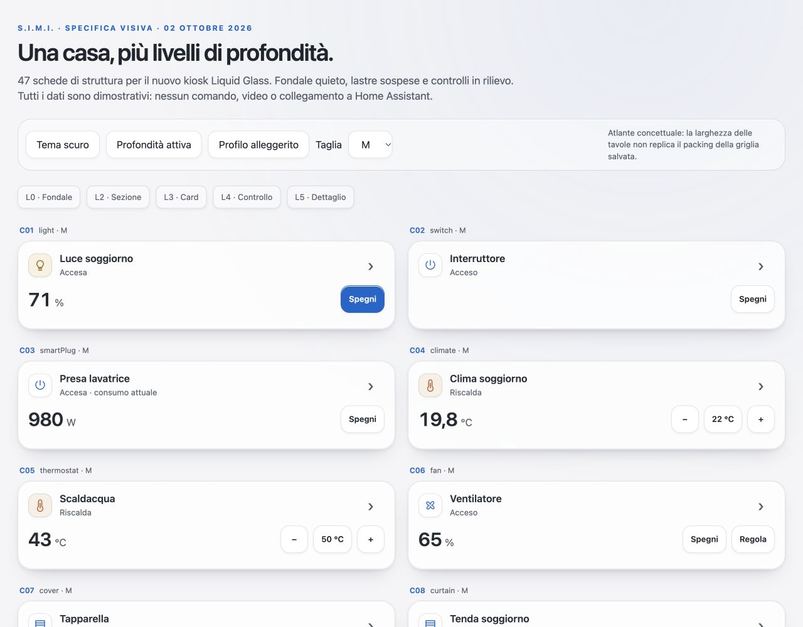
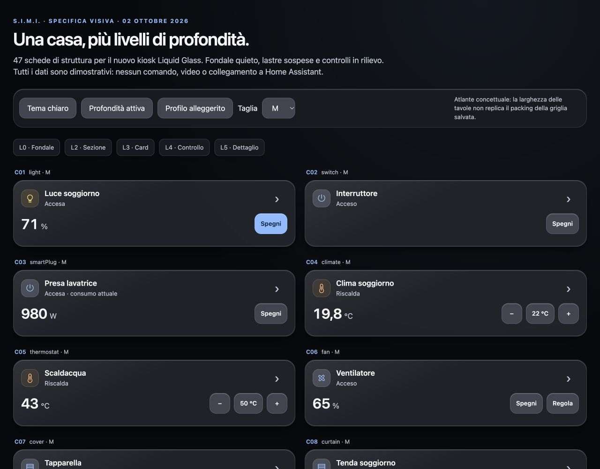

# S.I.M.I. — Audit grafico kiosk e specifica Liquid Glass

**Data:** 2 ottobre 2026  
**Destinazione:** tablet a muro, Fully Kiosk / Android; Light e Dark  
**Stato aggiornato al 3 ottobre 2026:** correzioni applicate nel repository e verificate localmente; collaudo fisico e deploy ancora da eseguire. Vedi §14. I §§1–13 conservano la diagnosi e la specifica iniziali.  
**Richiesta aggiornata:** interfaccia costruita su più livelli, con profondità e tridimensionalità Liquid Glass.

## 1. Esito e perimetro

Il problema principale non è la mancanza di effetti: alcune card ricevono un'altezza incompatibile con il loro contenuto; la cascata CSS altera dimensioni e comportamento dei controlli; tema e stati non hanno ancora una rappresentazione uniforme. Aggiungere blur prima di correggere questi aspetti renderebbe il problema più evidente.

La direzione proposta è un **Liquid Glass stratificato e leggibile**: un fondale quieto, superfici di organizzazione, card in rilievo, controlli distinguibili e pannelli sopraelevati. Le superfici acquistano profondità con bordi luminosi, ombre proporzionate e trasparenza controllata. Testo e comandi restano nitidi e stabili.

### 1.1 Cosa è stato controllato

- Kiosk LAN aperto nel browser: home, header, stato quieto e modalità ambient fotografica. Screenshot a 1280×800, 1024×600 e 800×1280.
- Componenti React reali in laboratorio locale isolato: **32 fixture × 5 taglie × 2 temi = 320 configurazioni misurate**. Viewport 1280×1000; geometria manuale canonica, dati sintetici.
- Fixture dedicata: stanza con sei dispositivi, taglia M, contenitore alto 500px.
- Lettura di shell, composer/stanze/griglia, renderer condiviso, mapper, clima, media, gruppi, widget informativi, CSS/token, ambient, pannelli e documentazione.
- Misure DOM: rettangoli delle card e dei controlli, font effettivi, touch-action, colori e controlli fuori dal bordo. Gli screenshot completano le misure: un testo tagliato non è necessariamente rilevato dalla sola misura dei controlli.

**Non equivale a 320 collaudi funzionali.** Non sono stati azionati dispositivi reali, avviati nuovi streaming Ring, provati audio fisico, standby hardware o GPU del tablet. Non sono stati verificati tutti i possibili attributi HA né tutti gli stati di ogni integrazione. Le conclusioni grafiche live e quelle del laboratorio sono distinte sotto.

La sessione ha aperto una pagina kiosk come normale client browser: questo può comportare le normali connessioni/registrazioni dell'app. Il laboratorio invece blocca API e audio e non usa la configurazione HA. Il monitoraggio periodico precedente non viene riavviato.

### 1.2 Evidenze e riproducibilità

| Evidenza | Contenuto | Limite |
|---|---|---|
| [Home Light](kiosk-audit-2026-10-02/live-1280-light.png) | Composizione live, header, spazio disponibile | Dati della singola installazione |
| [Home Dark](kiosk-audit-2026-10-02/live-1024-dark.png) | Layout live con viewport basso | Browser desktop ridimensionato |
| [Ambient portrait](kiosk-audit-2026-10-02/live-800-portrait.png) | Foto, ora, meteo, riepilogo | Non prova wake o luminosità fisica |
| [Card luce, cinque taglie](kiosk-audit-2026-10-02/lab-light-sizes.png) | Slider XL tagliato | Fixture sintetica |
| [Clima Light](kiosk-audit-2026-10-02/lab-climate-light.png) / [Dark](kiosk-audit-2026-10-02/lab-climate-dark.png) | Densità, clipping, colori | Nessun comando HA |
| [Clima con attributi null](kiosk-audit-2026-10-02/lab-climate-null.png) | Zero inventato per misure assenti | Caso limite riproducibile |
| [Stanza sovraccarica](kiosk-audit-2026-10-02/lab-room-overflow.png) | Sei M compresse sotto la soglia utile | Contenitore 500px |
| [Valvola](kiosk-audit-2026-10-02/lab-valve-dark.png) | Stato aperto trasformato in “--” | Fixture aperta al 100% |
| [Valore lungo](kiosk-audit-2026-10-02/lab-long-value-light.png) | Gerarchia numerica e nome tagliato in XL | Nessun overflow orizzontale misurato a questa larghezza |
| [Media](kiosk-audit-2026-10-02/lab-media-dark.png) | Stato e composizione musicale | Artwork assente intenzionalmente |
| [Misure Light](kiosk-audit-2026-10-02/misure-card-light.json) / [Dark](kiosk-audit-2026-10-02/misure-card-dark.json) | 160 configurazioni per file | Non misura pseudoelementi/hit test effettivo |

I file `fixture.tsx.txt`, `fixture.html.txt` e `server.mjs.txt` nella stessa cartella conservano il laboratorio usato. Copiarli temporaneamente nei percorsi indicati al §12 per ripetere le osservazioni; non aggiungerli all'app distribuita.

### 1.3 Come leggere le priorità

- **P1:** contenuto falso, comando difficile da usare, informazioni/controlli tagliati. Correggere prima del redesign.
- **P2:** incoerenza, accessibilità, leggibilità, comportamento responsive o costo grafico.
- **P3:** rifinitura e coerenza del sistema.
- **V:** riscontro visivo o misura nel browser; specificato se laboratorio o live.
- **S:** evidenza nel sorgente; scenario completo ancora da collaudare.
- **D:** decisione progettuale, non un bug dimostrato.

Non sono stati attribuiti P0 sulla sola base dell'audit grafico.

## 2. Nuovo contratto grafico e compatibilità

La richiesta esplicita dell'utente del 2 ottobre aggiorna il precedente vincolo “nessuna ombra / niente gloss multilayer” presente in AGENTS.md e DESIGN_SYSTEM.md: sono richiesti **profondità, tridimensionalità e più livelli Liquid Glass**.

Questa specifica autorizza nel progetto grafico ombre di elevazione, riflessi neutri e trasparenze differenziate. Non autorizza un secondo sistema di componenti, nuove dipendenze grafiche pesanti, distorsioni del testo o la riscrittura dell'app.

Restano validi:

1. Italiano nell'interfaccia; un solo accento interattivo blu, colori di stato con significato.
2. Light e Dark native attraverso token semantici; nessun filtro globale applicato a foto/video.
3. Touch minimo effettivo 44×44 CSS px, consigliato 48×48; niente funzioni accessibili solo con hover.
4. Fonte condivisa per anatomia, taglie e stati; conservare schema e dati di layout esistenti.
5. Opt-in dei dispositivi; non aggiungere entità per riempire spazi vuoti.
6. Videocamere nella tendina esplicita; non trasformare il redesign in nuove sessioni video automatiche.
7. Aggiornamento ottimistico e rollback visibile; profondità decorativa indipendente dallo stato del comando.
8. Nessuna modifica automatica a auth, credenziali, HASS, Fully o impostazioni di casa.

**Quando si implementa:** aggiornare insieme le sezioni estetiche di AGENTS.md e DESIGN_SYSTEM.md, indicando questa decisione e rimuovendo prescrizioni contraddittorie. In questo audit non vengono riscritte le istruzioni del repository né applicati nuovi token all'app.

## 3. Registro dei problemi e istruzioni di correzione

### G01 — La cascata CSS annulla la tipografia dei controlli · P1 · V/S

**File:** `src/index.css`, reset intorno alle righe 190–203; `ClimateCard.tsx`, QuickModes e footer.

Il reset `button, input, select, textarea { font: inherit }` è fuori dai layer CSS. Le utility Tailwind 4 sono dentro i layer: anche `text-[10px] font-semibold` può perdere contro il reset. Nel laboratorio i pulsanti modalità clima risultano **17px / peso normale**; cambia anche il budget di altezza.

**Intervento:** portare il reset in `@layer base`, lasciando ai componenti/utilities le scelte specifiche. Non riparare con una collezione di `!important`. Auditare analogamente gli altri selettori globali. Conservare il font base 17px finché non è valutato l'impatto su tutta l'app.

**Accettazione:** font computato coerente con il token richiesto; pulsanti e input leggibili; confronto screenshot dopo la correzione perché alcuni elementi diventeranno realmente più piccoli. Aumentare intenzionalmente i token troppo minuti invece di affidarsi al bug.

### G02 — Lo slider perde `touch-action: none` · P1 · V/S

**File:** `src/index.css:198`; `WidgetCardBase.tsx:310`.

Lo slider dichiara `touch-none`, ma il selettore globale `[role="slider"]` impone `manipulation`. Valore computato misurato: `manipulation`. Il browser può interpretare il trascinamento come gesto di scorrimento.

**Intervento:** stessa correzione di layer di G01; definire la politica del gesto nel controllo, non globalmente sul ruolo ARIA. Conservare pointer capture, gestione cancel, tastiera e separazione dal click della card.

**Accettazione:** stile computato `none` sul cursore interattivo; drag diagonale sul tablet non scrolla né aziona la card; fuori dallo slider lo scroll resta disponibile. Il gesto Android resta da provare fisicamente.

### G03 — Sei card M in stanza vengono schiacciate · P1 · V/S

**File:** `src/components/home/layers/RoomDashboard.tsx:43`; struttura simile in `NowSection.tsx`.

Sei card M occupano ciascuna 2 colonne × 3 righe. In una griglia a 3 colonne non entrano affiancate a coppie: servono 18 righe. Il contenitore dichiara sei righe flessibili, aggiunge righe implicite, forza `min-height:0` sulle card e nasconde l'overflow. A 500px le card della fixture diventano circa **71px**, con nomi e controlli tagliati e una colonna laterale vuota.

**Intervento:** calcolare capacità e packing effettivi prima di renderizzare. Usare scroll verticale o pagine con indicatori e pulsanti, senza ridurre le altezze sotto il budget della variante. Per la stanza prevedere una colonna a larghezza piena o due colonne reali nei formati opportuni; il layout di presentazione non deve riscrivere arbitrariamente il modello persistito.

**Accettazione:** sei M, mix XS/M/L, override tutte L e riquadro video aperto rimangono leggibili. Nessun contenuto nascosto senza un percorso evidente per raggiungerlo. Verificare anche NowSection: l'analogia sorgente non prova tutti i suoi casi.

### G04 — La griglia manuale scala anche testo e bersagli touch · P1 · S

**File:** `KioskWidgetHome.tsx:143–146, 325–329`.

`fitScale = gridViewportHeight / naturalGridHeight` applica `transform:scale(...)` all'intera griglia, senza un limite minimo utile. Un controllo da 44px diventa 22px a scala 0,5. La larghezza compensata non ripristina la dimensione verticale né il bersaglio touch.

**Intervento:** eliminare l'adattamento globale tramite scala nel percorso kiosk. Mantenere dimensioni reali; usare scroll o paginazione e densità esplicita. Preservare salvataggio, layoutVersion e posizioni esistenti.

**Accettazione:** layout con molte card a 1024×600 e 800×1280; nessun transform di scala sull'intero canvas in consultazione; comandi >=44px misurati dopo tutti i transform. Non modificare la configurazione live per riprodurlo.

### G05 — XL è larga ma bassa: il contenuto viene tagliato · P1 · V/S

**File:** `WidgetCardFactory.tsx`, `WidgetCardBase.tsx`, `utils/getWidgetSizeConfig.ts`, `HomeGridCanvas.tsx`.

La geometria canonica dà a XL **142px**, come M/S, non l'altezza L di 298px. Il renderer generico usa un impilamento e padding da card grande. Nei test luce, ventola e umidificatore lo slider XL esce dal bordo; nella luce supera il fondo di circa **12,6px**. Anche il nome del sensore numerico XL risulta tagliato nello screenshot.

**Intervento:** variante XL realmente orizzontale: identità a sinistra, misura al centro, comandi a destra. Disporre lo slider in un'area di controllo dedicata da almeno 44px. Non risolvere con altro `overflow:hidden`, font più piccolo o padding negativo.

**Accettazione:** luce/ventola/umidificatore/sensore nelle cinque taglie, titolo su due righe, stato pending e messaggio errore: nessun comando o nome obbligatorio tagliato. Il rettangolo utile include hit-area e focus ring.

### G06 — Clima M accumula troppe sezioni · P1 · V

**File:** `src/components/widgets/ClimateCard.tsx`.

Header, misura stanza, dial setpoint, metadati e controlli non rientrano sempre nei 142px reali. Screenshot Light/Dark: testo inferiore e parte del dial M sono tagliati.

**Intervento:** M = nome/stato + temperatura attuale + setpoint/stepper; spostare umidità, oscillazione, preset e modalità estese nel dettaglio. L può contenerli. XL usa tre zone orizzontali, non una L compressa. Il dial è opzionale, ha senso solo se leggibile e non duplica il setpoint.

**Accettazione:** titolo lungo, sei modalità, umidità, target assente e font aumentato; nessun overlap. Se il dial non entra, sostituirlo con il numero senza perdere un comando.

### G07 — Controlli sotto 44px e hit-area fragili · P1 · V/S

**File:** `ClimateCard.tsx`; `WidgetCardBase.tsx:233,260,310,410`.

Nel laboratorio: power clima compatto 34px; stepper/modalità 38,25px; footer interattivo 29,75px. Alcuni controlli generici hanno `tap-target`, ma la sua estensione non è inclusa nella misura del box; overflow e clipping possono limitarla. In particolare il pulsante hold contiene `overflow-hidden`.

**Intervento:** adottare box interattivi veri da 44/48px, mantenendo il glifo interno da 18–24px. Spostare il clip della progressione hold su un figlio decorativo. Evitare hit-area invisibili sovrapposte; verificare con hit test, non solo con classi CSS.

**Accettazione:** minimo 44×44 effettivo per ogni controllo, distanza sufficiente tra azioni antagoniste, hit-area interamente dentro la superficie visibile. Il test non deve considerare il pulsante “intera card” come compensazione per uno stepper troppo piccolo.

### G08 — Dark segue due autorità diverse · P1 · V/S

**File:** `src/index.css`, `html.dark` e rimappature da riga 1146; classi `dark:*` nei componenti.

Il tema applicativo usa `html.dark`; manca una variante Tailwind dark dichiarata per questa classe. Rimappature manuali di classi legacy coprono solo una lista finita. In laboratorio con tema app Dark e sistema Light, `text-black/42` e alcuni riempimenti rimangono neri: umidità e metadati clima perdono leggibilità.

**Intervento:** dichiarare la variante class-based nel CSS Tailwind, poi migrare le card a token semantici. Rimuovere le rimappature legacy solo quando i relativi consumer sono migrati. Verificare la matrice app Light/Dark × sistema Light/Dark.

**Accettazione:** stesso aspetto per il tema scelto dall'app indipendentemente dal sistema operativo; nessun testo nero involontario su vetro scuro.

### G09 — Etichette bianche su riempimenti luminosi · P1 · V

**File:** `ClimateCard.tsx`, selezione modalità; token di stato.

Misurato su modalità caldo Dark: testo bianco su `rgb(255,159,10)`, contrasto calcolato **2,06:1** per le tinte opache. Il bianco su `rgb(100,181,255)` produce circa 2,19:1. Il primo caso è documentato dalle misure; il secondo è un controllo della coppia cromatica, non una dichiarazione su ogni bottone blu dell'app.

**Intervento:** token distinti `state-fill` e `state-on-fill`, oppure stato selezionato con fondo tenue + testo più scuro/chiaro adeguato. Non assumere `white` come colore universale.

**Accettazione:** obiettivo di progetto 4,5:1 per testo normale, 3:1 per testo grande e bordi/indicatori essenziali. Su vetro misurare il colore composito effettivo sui fondali più sfavorevoli; non basta il token sorgente.

### G10 — Valori clima null diventano zero · P1 · V/S

**File:** `ClimateCard.tsx:46–49,106–110`.

`Number(null)` restituisce 0: la fixture con current_temperature, temperature e current_humidity null mostra **0°C, set 0°C e 0%**. Non sono dati reali.

**Intervento:** usare un parser condiviso che rifiuti null, undefined, stringhe vuote e valori non finiti prima della conversione. Mostrare “— / Dato non disponibile”, conservando il layout. Abilitare la modifica solo quando esiste un target valido o una policy esplicita già prevista dal dominio.

**Accettazione:** null, undefined, "", NaN e 0 reale distinti; unità reali conservate; nessun default grafico che sembri una lettura HA.

### G11 — Valvola aperta visualizzata come misura mancante · P1 · V/S

**File:** `utils/mapEntityToWidgetCard.ts:221,358–386`.

`valve` è assegnato a `water` e passa dal ramo numerico: `open` diventa “--”, sebbene la valvola sia aperta e il factory mostri Apri/Chiudi.

**Intervento:** discriminare attuatore valvola da sensore acqua. Nome, “Aperta/Chiusa/In movimento”, posizione solo se disponibile, comandi coerenti con capability. Il sensore acqua mantiene quantità/unità.

**Accettazione:** open/closed/opening/closing/unknown/unavailable mostrati correttamente; mai trattare lo stato di un attuatore come un numero mancante.

### G12 — Stati serratura e allarme troppo semplificati · P1 · S

**File:** `utils/mapEntityToWidgetCard.ts:303–328`.

Per la serratura ogni stato diverso da unlocked diventa “Bloccata”: anche jammed, locking e unlocking. Nell'allarme `rawState.includes('armed')` corrisponde anche a `disarmed`. Il secondo difetto riguarda il modello di presentazione; il testo tradotto può comunque essere corretto, quindi non è provato che la schermata mostri sempre “Inserito”.

**Intervento:** mappa esaustiva degli stati; riusare il helper esistente dell'allarme. Distinguere stato transitorio, jam e indisponibilità. Conservare hold 900ms per lo sblocco e non introdurre nuovi comandi.

**Accettazione:** fixture per ogni stato; icona, testo, severity, aria-label e controllo concordano. Nessuna indicazione “sicura” quando lo stato è incerto.

### G13 — Taglia di contenuto e ingombro possono divergere · P1 · S

**File:** `HomeWidgetView.tsx:62–64`; `HomeGridCanvas.tsx`.

La dimensione del contenuto può essere risolta attraverso gli override cardSizes dopo che il footprint è stato calcolato da widget.size. Un contenuto L in un ingombro più piccolo non diventa leggibile tramite min-height.

**Intervento:** definire una risoluzione unica della taglia effettiva prima del packing; distinguere dimensione salvata e densità di rendering senza farle contraddire. Migrare/normalizzare solo tramite il percorso di layout esistente, con layoutVersion.

**Accettazione:** tutte le combinazioni di override singolo/multiplo e widget salvato; anteprima, canvas e server concordano. Nessuna perdita dei widget al cambio orientamento.

### G14 — Troppa informazione essenziale a 8–11px · P2 · V/S

**File:** `ClimateCard.tsx`, `MediaCardContent.tsx`, `WasteCollectionCard.tsx`, `StatusHeader.tsx`.

Etichette clima 8/9px, metadati media 9/10px e raccolta XS 11px richiedono una lettura ravvicinata. Nel live il piccolo testo della raccolta è circondato da molto spazio disponibile.

**Intervento:** minimo di progetto 13px per metadati utili; 15/16px per nomi e stato primario nelle taglie comuni; 12px solo per dettagli non essenziali. Se il contenuto non entra, omettere dettagli secondari o usare il pannello, senza comprimere tutto.

**Accettazione:** verifica alla distanza reale dal tablet, non solo screenshot ingrandito; testo aumentato al 125% senza perdita di comandi.

### G15 — Stato “Accesa” ripetuto e gerarchia ridondante · P2 · V

**File:** `WidgetCardFactory.tsx` e `WidgetCardPowerState`.

La luce ripete “Accesa” nel badge e in “Accesa · 71%”. Le ripetizioni consumano lo spazio che manca agli slider.

**Intervento:** una riga semantica di stato; indicatore power può essere solo icona/switch con nome accessibile. Se la card mostra già 71%, non ripetere lo stesso valore in tre elementi.

**Accettazione:** ogni informazione ha un solo ruolo visivo dominante; stato accessibile completo anche quando il badge testuale viene tolto.

### G16 — Etichette media e annunci non adeguati · P2 · S

**File:** `MediaCardContent.tsx`; factory e mapper media.

Il contenitore usa `aria-live="polite"` anche per progressione temporale. La presentazione contiene terminologia “Live” associata alla riproduzione, che non distingue necessariamente una diretta da un brano registrato. Alcune etichette clima rimangono DRY, SET, ON e Swing vertical.

**Intervento:** “In riproduzione”, “In pausa”, “Diretta” solo quando nota; “Impostata”, “Deumidifica”, “Oscillazione verticale”. Limitare gli annunci a cambio brano/stato/errore, non ai secondi. Conservare identificazione del dispositivo nelle taglie compatte.

**Accettazione:** revisione testi italiana e prova screen reader separata; nessun annuncio continuo del tempo.

### G17 — Personalizzazioni di icona/tipo non uniformemente riflesse · P2 · S

**File:** `HomeWidgetView.tsx:35–43`, `WidgetCardFactory.tsx:382,404`, mapper.

Il modello passa `roomEntity.icon`, ma il factory usa `mapped.Icon`. La famiglia viene scelta prevalentemente dal dominio; l'override type ha un trattamento speciale per security. Non tutte le scelte presentate nella regia sono necessariamente visibili nella card.

**Intervento:** esplicitare precedenze tra dominio, tipo scelto e icona custom, con allowlist di override sensati. Riutilizzare DynamicIcon; il comportamento del servizio resta legato al dominio reale. Anteprima e kiosk devono usare lo stesso renderer.

**Accettazione:** rinomina/icona/tipo permesso uguali in preview, home e stanza; configurazioni legacy non valide degradano chiaramente.

### G18 — La luce a tap non espone un accesso secondario evidente · P2 · S

**File:** `WidgetCardFactory.tsx:391`; `ContextualPanel` / `LightDetail`.

La primary action della luce è toggle; il normale gesto di apertura dettaglio del factory è sostituito. Il dettaglio colore/temperatura esiste ma non è reso esplicito da quella card. Questo non prova l'assenza di qualunque altro accesso nell'app.

**Intervento:** conservare tap rapido dove già previsto e aggiungere un ingresso “Dettagli” da 44px nelle taglie compatibili; XS apre il dettaglio se non c'è spazio per due azioni. Non introdurre long-press non indicati.

**Accettazione:** dal tablet si raggiungono luminosità, colore e temperatura supportati senza passare dalla regia; icona dettaglio e toggle non si sovrappongono.

### G19 — Scala cromatica sensori non specifica per unità · P2 · S

**File:** `utils/mapEntityToWidgetCard.ts:358–386`; `getRingColorScale.ts`.

Il ramo airQuality usa una scala comune per misure di natura diversa; temperatura usa il numero senza conversione della scala cromatica rispetto all'unità. 72°F non significa 72°C. Alcuni toni calcolati non sono effettivamente visibili quando isActive è false: il difetto è anche nel contratto dati/presentazione, non necessariamente un colore errato su tutte le card attuali.

**Intervento:** separare metrica, unità, validità e severity. Soglie solo quando previste per quel device_class/unità o configurate; altrimenti colore neutro. Conservare il numero reale; nessuna interpretazione sanitaria arbitraria.

**Accettazione:** °C/°F, CO₂/PM2.5/AQI/VOC, W/kW/kWh non condividono scale improprie; warning visibile anche su un sensore passivo.

### G20 — Unknown/offline e messaggi d'errore perdono distinzione · P2 · S

**File:** mapper; `WidgetCardBase.tsx`, unavailable/error/skeleton.

unknown e unavailable vengono assimilati; opacità del contenitore e testo già attenuato possono sommarsi. Card XS e card grandi non devono avere la stessa quantità di messaggio.

**Intervento:** stati universali al §8; lasciare nome e messaggio leggibili, disabilitando i soli comandi. Loading conserva geometria, offline conserva ultimo dato solo con etichetta di obsolescenza. Errore comando non equivale a dispositivo offline.

**Accettazione:** fixture per loading/unknown/unavailable/stale/pending/error; contenuto non scompare; nessun successo mostrato solo per una richiesta inviata.

### G21 — Colore di sfondo CSS costruito in modo invalido · P2 · S

**File:** `src/components/contextual/ContextualPanel.tsx:41`.

`background: meta.color + "22"` non funziona quando meta.color è una stringa `var(--...)`. Il token non è un colore hex a cui aggiungere l'alpha.

**Intervento:** token dedicato di fondo o `color-mix(in srgb, var(--state-color) 14%, transparent)` con fallback per il WebView minimo supportato. Non concatenare alpha a variabili CSS.

**Accettazione:** computed background valido in entrambi i temi per luce, clima, media, allarme e fallback; non cambia il colore del glifo.

### G22 — Overlay caldi e materiali non coordinati · P2 · S/D

**File:** `DuskLayer.tsx`, `index.css` (.kiosk-color-canvas, .widget-card-tint), `AnimatedCard.tsx`.

DuskLayer usa un velo globale multiply fino al 6%; la sua composizione dipende anche dagli stacking context. Le card ricevono tinte e animazioni attraverso sistemi diversi. Il nuovo Liquid Glass richiede una gerarchia comune, non la sovrapposizione di tutti gli effetti esistenti.

**Intervento:** portare eventuale variazione serale solo nel fondale L0; eliminare il velo globale dal percorso contenuti/media. Unificare materiale ed elevazione secondo §4. Colore funzionale come segnale locale; evitare che ogni card diventi una diversa lastra colorata.

**Accettazione:** stessa foto/frame video con stessi colori in Light/Dark/sera; controlli e testo fuori dai layer filtrati; confronto a parità di contenuto.

### G23 — Blur del backdrop non rispetta pienamente perf-lite · P2 · S

**File:** `GlassSheet.tsx:155–168`; `index.css` regole .perf-lite.

Il backdrop dello sheet applica blur inline anche se il materiale .glass viene alleggerito. Il costo hardware non è stato profilato in questa sessione.

**Intervento:** spostare il backdrop su token/classi di profilo; `perf-lite` disabilita anche il blur della maschera. Limitare a una superficie campionante per pixel quando possibile. Evitare blur dentro blur e animazione del raggio.

**Accettazione:** computed backdrop-filter none in saver; nessuna variazione della leggibilità; misure su Fully prima di affermare un miglioramento di FPS/consumi.

### G24 — Fila camere fissa e header largo · P2 · S

**File:** `CameraMonitoringRow.tsx`; `StatusHeader.tsx:137–212`.

La fila video usa sempre tre colonne, anche con una camera; l'header è un gruppo non comprimibile con elementi condizionali. Con energia, wallbox e allarme presenti serve una verifica delle larghezze intermedie. Non sono stati attivati stream per provarla.

**Intervento:** colonne video basate su numero e spazio, almeno un rapporto video utile; messaggio esplicito se l'utente apre una tendina senza camere. Header con gruppi ordinati e wrap intenzionale, non clipping. Le voci secondarie possono aprire un pannello “Stato casa”.

**Accettazione:** 0/1/2/3 camere e tutti i chip header a 600–1280px; tasto chiudi sempre raggiungibile; nessuno streaming su mount nascosto.

### G25 — Gruppi e widget informativi non condividono il budget delle card · P2 · S

**File:** `GroupCard.tsx`, `AnimatedCard.tsx`, `HomeWidgetView.tsx`, widget meteo/news/persone.

Esistono wrapper, min-height, padding e limiti di righe diversi. Liste di membri/previsioni/notizie non diventano sicure solo aggiungendo overflow hidden. La griglia ne impone comunque l'altezza.

**Intervento:** budget di contenuto unico, wrapper materiale comune, quantità visibile per dimensione con “Altri N / Apri”. Preservare componenti di dominio e logica di gruppo; evitare una seconda libreria di card.

**Accettazione:** ogni tipo del catalogo nel suo ingombro minimo, massimo e wide; numero di elementi eccedenti sempre recuperabile.

### G26 — Ordine degli overlay e angoli ambient da coordinare · P2 · S

**File:** `AmbientLayer.tsx`, `KioskAlarmAudioChannel.tsx:48`, `GlassSheet`, overlay sistema.

L'orologio ambient usa l'angolo inferiore destro; il CTA audio usa lo stesso angolo con z130 e posizione fissa. È un rischio geometrico quando coesistono, non un overlap dimostrato dallo screenshot ambient allegato. Z-index separati per componente rendono difficile governare più overlay.

**Intervento:** una scala di livelli e aree riservate, con precedenza delle emergenze. CTA audio dentro uno slot di stato/avviso; non coprire conferme, ora o chiusura. Non nascondere un avviso di audio bloccato solo per estetica.

**Accettazione:** prova combinazioni ambient+audio bloccato, allarme+sheet, update+offline, tastiera aperta e safe area. I livelli del §4 sono una proposta da integrare con focus e portal.

### O01 — Home vuota, grande card con testo minuscolo · P3 · V/D

Nel live osservato compare una sola card raccolta compatta; non è un errore che i dispositivi non selezionati siano assenti. La configurazione può essere intenzionale. Lo spazio può però essere usato meglio senza introdurre entità.

Proporre una composizione quieta con pochi blocchi proporzionati, titoli leggibili e un messaggio sobrio quando non ci sono dispositivi scelti. Rispettare un override XS esplicito; non trasformarlo automaticamente in L. Non usare dati finti o suggerimenti di guasti non rilevati.

### O02 — Valori lunghi senza raggruppamento e card L vuote · P3 · V/D

Il numero sintetico lungo non ha prodotto overflow orizzontale a 1280px, ma manca una buona scansione delle cifre e la card L resta prevalentemente vuota. Usare Intl.NumberFormat italiano, precisione per metrica e unità separate. Una L può mostrare un grafico solo con dati storici reali, altrimenti una misura chiara, data di aggiornamento e accesso al dettaglio; niente grafici decorativi inventati.

## 4. Architettura visiva Liquid Glass a più livelli

**[Apri l'atlante interattivo delle 47 famiglie](kiosk-audit-2026-10-02/ATLANTE_LIQUID_GLASS.html).** È un file HTML autonomo: nessuna libreria esterna, API o collegamento HA. Permette di confrontare Light/Dark, cinque taglie, profondità attiva/disattivata e profilo alleggerito. Le azioni disegnate nelle card sono inerti. Le tavole illustrano gerarchia e materiali, non certificano il packing finale, tutte le capability o il contrasto dell'app.





### 4.1 Profondità percepita e ordine dei piani

L'interfaccia deve far percepire che i controlli sono appoggiati su card, le card su un piano organizzativo, e i pannelli davanti alla home. La tridimensionalità nasce dalla relazione tra superfici, non da inclinazioni continue.

```text
           verso l'utente
                 ↑
     L6  emergenza / dialogo prioritario
     L5  pannello di dettaglio, con fondale attenuato
     L4  controllo in rilievo + focus / feedback
     L3  card: contenuti nitidi sopra una lastra di vetro
     L2  cornice di sezione / dock / barra di stato
     L1  luce ambientale neutra, statica e molto tenue
     L0  fondale continuo Light o Dark
```

| Piano | Materiale e profondità | Uso | Regola |
|---|---|---|---|
| L0 | Parchment Light / nero caldo Dark | Sfondo pagina | Nessun blur; non è una foto |
| L1 | Luce diffusa neutra, opacity bassa | Separazione spaziale del fondale | Statica; mai sopra testo/media |
| L2 | Vetro quieto, bordo sottile, ombra corta | Header, dock stanze, eventuale sezione | Non trasformare ogni contenitore in un altro blur |
| L3 | Lastra più definita, highlight superiore, ombra di contatto + diffusa | Card | Un materiale comune per tutte le famiglie |
| L4 | Riempimento più opaco, bordo interno, ombra molto corta | Toggle, stepper, slider thumb, azione | Box vero 44/48px; stato distinto dal rilievo |
| L5 | Vetro più opaco, ombra maggiore, backdrop unico | Sheet, dettaglio, inventario | Testo mai trasparente; focus intrappolato nel dialogo |
| L6 | Superficie prevalentemente solida ad alto contrasto | Emergenza | Comprensibilità prima dell'effetto |

**Z-index proposti, da integrare e collaudare:** base 0, header/dock 20, menu 40, sheet 60, ambient 80, avviso connessione/aggiornamento 100, emergenza 120, comandi di emergenza 130. Non assegnare numeri liberamente dentro i componenti. Un avviso ordinario non deve superare automaticamente un'emergenza.

Questa scala non impone che gli overlay siano visibili contemporaneamente: un coordinatore deve decidere presenza, priorità, focus e restore. Portal al livello root; `isolation:isolate` per le superfici locali, evitando z-index interni che scavalcano l'intero sistema.

### 4.2 Anatomia interna della lastra

```text
card root: layout, hit-area, focus e ombra esterna (non tagliati)
 ├─ material clip: radius condiviso, overflow hidden
 │   ├─ base glass: tinta neutra + eventuale backdrop-filter
 │   ├─ edge highlight: hairline superiore, pointer-events none
 │   └─ state veil: colore locale leggero, non su foto/video
 ├─ content: icona, nome, stato, valore; opacità 1
 ├─ controls: superfici autonome, mai un secondo backdrop-filter
 └─ feedback: focus / invio / errore / drag
```

Non applicare `opacity` all'intera card per renderla “di vetro”: attenuerebbe testo e controlli. Non applicare `filter:blur` al contenitore dei contenuti. Separare il clip interno dall'ombra esterna; l'attuale `contain:paint`/overflow può tagliare ombre, focus e hit-area e va assegnato al livello appropriato.

### 4.3 Token proposti

Valori iniziali per il prototipo, da validare su Android. Definirli in `src/index.css` e riesporre i riferimenti in `src/design/tokens.ts`. Non duplicarli nelle singole card.

| Token proposto | Light | Dark |
|---|---|---|
| --glass-page | #f5f5f7 | #08090c |
| --glass-section | rgba(255,255,255,.34) | rgba(32,34,40,.44) |
| --glass-card | rgba(255,255,255,.76) | rgba(35,38,45,.86) |
| --glass-control | rgba(255,255,255,.94) | rgba(67,71,82,.96) |
| --glass-sheet | rgba(250,250,252,.94) | rgba(29,31,37,.96) |
| --glass-edge-top | rgba(255,255,255,.92) | rgba(255,255,255,.22) |
| --glass-edge-bottom | rgba(35,44,63,.12) | rgba(255,255,255,.07) |
| --glass-shadow-contact | 0 2px 4px rgba(25,35,55,.06) | 0 2px 5px rgba(0,0,0,.28) |
| --glass-shadow-card | 0 10px 26px -16px rgba(25,35,55,.30) | 0 12px 28px -15px rgba(0,0,0,.70) |
| --glass-shadow-sheet | 0 26px 64px -24px rgba(20,28,44,.32) | 0 28px 72px -20px rgba(0,0,0,.78) |
| --glass-blur-card | 12px | 12px |
| --glass-blur-sheet | 18px | 18px |
| --glass-radius-card | 22px | 22px |
| --glass-radius-control | 14px / pill | 14px / pill |
| --glass-radius-sheet | 28px | 28px |

Gli esadecimali sono valori del sistema di token, non nuove utility sparse. Testo usa gli attuali --ink/--ink-secondary opportunamente verificati. I colori funzionali mantengono nomi semantici; aggiungere per ciascuno la coppia fill/on-fill.

**Riflessi:** un solo highlight neutro sottile vicino al bordo superiore; nessun riflesso animato che attraversi continuamente il testo. Consentita una lieve variazione luminosa del materiale, comune alle famiglie. Il blu/ambra/verde/rosso resta principalmente su glifi, indicatori e controlli.

**Rifrazione:** niente filtri SVG di displacement, lente dinamica sotto il dito o distorsione dei numeri. L'effetto vetro è rappresentato con trasparenza, bordi e contrasto fra piani; non serve WebGL.

### 4.4 Profili di qualità

| Profilo esistente | Materiale | Animazione | Da preservare |
|---|---|---|---|
| quality | Blur card 12px; sheet 18px, fondale stabile | Press 140ms; apertura 240–320ms | Profondità completa |
| balanced | Blur ridotto 6–8px solo sulle superfici principali; card più opache | Nessun loop decorativo; transizioni brevi | Bordi, ombra e gerarchia |
| saver / perf-lite | Backdrop-filter none ovunque; fondi quasi solidi | Feedback immediato/fade minimo | Profondità tramite contatto, hairline e contrasto |
| reduced-motion | Materiale coerente col profilo | Niente scale, drift, parallax o spring decorativi | Focus e stato comprensibili senza movimento |

Non introdurre un secondo interruttore prestazioni separato da `usePerfMode`. Reduced motion e riduzione trasparenza sono preferenze distinte: se il WebView supporta la seconda, fornire superficie più opaca; altrimenti il profilo saver è il fallback esplicito.

### 4.5 Movimento e tridimensionalità

- **Press:** controllo scende visivamente di 1px; ombra più corta, highlight attenuato. Nessuno spostamento permanente e nessun resize del layout.
- **Apertura dettaglio:** 240–320ms, opacity e piccola traslazione; card sorgente rimane stabile. Non scalare testo da 0,28 durante l'intera apertura su un dispositivo lento.
- **Ingresso home:** stagger massimo 20–30ms, una volta; non a ogni delta HA.
- **Drag editor:** elevazione più alta e bordo attivo, sagoma di destinazione chiara. Movimento solo durante il drag; non inclinare le card statiche.
- **Animazioni icona:** solo se indicano attività reale; non far “respirare” tutte le superfici.
- **Tilt 3D:** escluso dal default touch. Un eventuale esperimento desktop deve restare decorativo, <=1°, senza modificare coordinate utili e disabilitato in reduced-motion/saver.
- **will-change:** attivo solo durante transizioni necessarie; non su decine di card inattive.

## 5. Geometria, responsive e budget di contenuto

### 5.1 Separare ingombro e anatomia

Schema corrente persistito: 3 colonne, riga 38px, gap 14px. Non usare gli storici 8×64 come base di una migrazione.

| Taglia | Footprint corrente | Altezza geometrica con gap 14px | Anatomia proposta |
|---|---|---:|---|
| XS | 1×2 | 90px | Riga compatta: icona + nome/stato + al massimo un'azione |
| S | 1×3 | 142px | Header con controllo, identità e stato; niente slider aggiunto in fondo |
| M | 2×3 | 142px | Due zone: identità/misura e controlli; dettagli secondari nel pannello |
| L | 3×6 | 298px | Header + area dati + comandi/dettaglio |
| XL | 3×3 | 142px | Tre zone orizzontali; NON L con altezza dimezzata |

Formula: `altezza = righe × 38 + (righe − 1) × 14`. I minHeight del componente non sostituiscono questa geometria. Nel composer le righe flessibili producono altre altezze: la variante deve essere scelta in base allo spazio utile, senza forzare la card a zero.

### 5.2 Budget verticale vincolante

| Taglia | Padding proposto | Spazio utile | Contenuto ammesso |
|---|---:|---:|---|
| XS | 10px | 70px | Testo 2 righe max; azione 44px; icona 28–32px |
| S | 12px | 118px | Riga superiore 44px, gap 8px, nome fino a 40px, stato 18px |
| M | 12–14px | 114–118px | Due colonne interne; ogni colonna <=118px; comandi 44px |
| L | 20px | 258px | Header 44, area centrale circa 128, footer 44, gap 12+12 |
| XL | 16px | 110px | Colonne interne autonome; una coppia di controlli 44+8+44 |

Se un messaggio d'errore non entra, sostituire temporaneamente la riga secondaria e aprire il dettaglio; non aggiungere una quarta riga al fondo. Se S non riesce a conservare titolo e comando da 44px alla larghezza disponibile, usare una variante con apertura dettaglio.

### 5.3 Regole responsive proposte

- Valutare **larghezza del contenitore e altezza disponibile**, non il solo viewport. Preferire container query compatibili con il WebView supportato; fallback con misure già presenti.
- >=1024px: griglia canonica visibile quando utile; dock/stanze separati; M e XL orizzontali.
- 768–1023px: valutare colonne effettive e nomi lunghi; header su due gruppi/righe se necessario.
- 600–767px: evitare tre colonne di comandi compressi; layout di consultazione a una/due colonne con reflow derivato.
- <600px: fallback a una colonna, scroll esplicito, dettaglio a schermo quasi pieno. Non è il target primario, ma non deve diventare inutilizzabile.
- Altezza <=650px: ridurre margini e decorazioni, poi usare pagine/scroll. Mai scalare l'intera UI.
- Rotazione: conservare selezione, stato, pagina e draft; ricalcolare solo la presentazione. Non salvare automaticamente una disposizione diversa.
- Safe area: applicare padding globale una volta; pannelli e CTA rispettano tastiera e visual viewport.

### 5.4 Tipografia e misura

| Ruolo | XS/S | M/XL | L |
|---|---|---|---|
| Nome | 13–14px / 600 | 15–16px / 600 | 17px / 600 |
| Stato | 13px / 400 | 14px / 400 | 14–15px / 400 |
| Valore | 20–24px | 28–32px | 36–44px |
| Metadato | 12–13px | 13px | 13px |
| Etichetta comando | 14px / 600 | 14–15px / 600 | 15px / 600 |

Unità 0,55–0,65em rispetto al valore, allineate alla baseline ma con minimo leggibile. Numeri tabulari, locale italiano, separatore delle migliaia quando utile. Non ridurre senza limite il font per far entrare un numero: passare a una precisione coerente o a una notazione compatta esplicitamente indicata, con dato completo nel dettaglio.

## 6. Archetipi grafici riutilizzabili

Ogni famiglia del §7 sceglie un archetipo, con le eccezioni indicate. Si evolvono WidgetCardBase/Factory e componenti specializzati; non si creano 47 shell indipendenti.

### A — Attuatore semplice

```text
S                         M / XL
┌────────────────────┐    ┌─────────────────────────────────────────┐
│ icona       toggle │    │ icona  Nome dispositivo   [toggle] [›] │
│ Nome (max 2 righe)  │    │        Accesa · 71%       [slider 44] │
│ Accesa · 71%       │    └─────────────────────────────────────────┘
└────────────────────┘    slider solo se supportato e compatibile
```

XS: una riga con apertura dettaglio o azione unica; S non contiene lo slider. L può mostrare slider e controlli secondari realmente supportati. L'area `›` è Dettagli, con nome accessibile completo.

### B — Misura

```text
┌──────────────────────────┐
│ icona metrica       [›]  │
│ 22,5 °C                  │  valore dominante, unità distinta
│ Temperatura soggiorno    │
│ Aggiornata 2 min fa       │  solo se utile / stale
└──────────────────────────┘
```

XS: nome + valore su righe; M/XL valore a fianco dell'identità; L aggiunge storico SOLO se disponibile. Soglia critica: icona e testo espliciti, non solo un anello colorato.

### C — Clima / setpoint

```text
M
┌────────────────────────────────────────────────┐
│ icona  Clima soggiorno                   [›]   │
│ 19,8 °C    Riscalda      [−] 22,0 °C [+]       │
└────────────────────────────────────────────────┘
L
┌────────────────────────────────────────────────┐
│ icona  Clima soggiorno              [power][›] │
│ 19,8 °C attuale   [−] 22,0 °C [+] impostata   │
│ [Caldo] [Freddo] [Auto] [Altre modalità]        │
│ Umidità 48%                 [Ventola / preset] │
└────────────────────────────────────────────────┘
```

XS/S: priorità a nome, stato e temperatura attuale; setpoint solo se entra con comandi accessibili. XL: identità | attuale/target | stepper e modalità selezionata. La lista completa delle modalità non vive obbligatoriamente nella card.

### D — Movimento, posizione e azioni protette

```text
┌────────────────────────────────────────────────┐
│ icona  Tapparella soggiorno               [›]  │
│ In apertura · 40%         [↑] [Stop] [↓]       │
└────────────────────────────────────────────────┘
```

Serratura: stato chiarissimo e azione protetta con testo “Tieni premuto per sbloccare”, indicazione progressiva, cancel all'uscita/interruzione. Il comando stop degli attuatori deve essere almeno evidente quanto gli altri.

### E — Media e video

```text
┌────────────────────────────────────────────────┐
│ artwork       Diffusore soggiorno              │
│ o frame       Titolo · Artista                 │
│ non filtrato  [precedente] [play/pausa] [›]    │
│               01:00 ━━━━━━━━━━━━━ 04:00        │
└────────────────────────────────────────────────┘
```

Glass soltanto nella cornice e nella fascia controlli; niente blur del frame. Video: diretta/connettendo/immagine statica con età, senza chiamare “live” uno snapshot. XS media apre dettaglio o play singolo; videocamera solo nella tendina, con spazio sufficiente.

### F — Sicurezza / presenza / stato binario

```text
┌────────────────────────────────────────────────┐
│ icona stato  Porta ingresso               [›] │
│ Aperta                                         │
│ Rilevata alle 20:12                             │
└────────────────────────────────────────────────┘
```

Allarme vero: testo specifico, icona e tinta locale inequivocabili; la card non sostituisce l'overlay emergenza. Presenza non è allarme: “In casa / Fuori casa / Dato assente” con tono neutro.

### G — Azione / scena / timer

```text
┌────────────────────────────────────────────────┐
│ icona  Scenario sera                           │
│ Luci soggiorno e tende            [Esegui]     │
└────────────────────────────────────────────────┘
```

Scena/script sono azioni momentanee, non toggle persistenti. Timer ha durata/progresso solo se noti; stop/annulla separati dall'avvio, nessun tap ambiguo.

### H — Riepilogo / lista / contenuto

```text
┌────────────────────────────────────────────────┐
│ icona  Raccolta rifiuti                    [›] │
│ Oggi       Organico                            │
│ Domani     Carta e plastica                     │
│                                      Altri 2  │
└────────────────────────────────────────────────┘
```

Numero di righe calcolato sul budget, non fisso per nome taglia. Identificare titolo e fonte; emptiness ed errore diversi; lista completa nel pannello. Il token del materiale è lo stesso delle card dispositivo.

## 7. Specifica di ogni famiglia di widget card

### 7.1 Copertura

La union `WidgetFamily` in `utils/mapEntityToWidgetCard.ts` dichiara **47 famiglie**. La tabella seguente le copre tutte. Non significa che esistano 47 renderer specializzati: alcune sono alias, famiglie solo dichiarate o fallback generici. L'implementazione deve collegare soltanto dati e capability esistenti; niente nuove funzionalità simulate per soddisfare il disegno.

“Dettaglio” significa ingresso accessibile al pannello già esistente o al suo completamento esplicitamente pianificato. Dove mancano dati/capability, mostrare stato/assenza dati e omettere il comando. Tutte le righe ereditano livelli Liquid Glass, budget e stati universali.

| ID / famiglia | Struttura e gerarchia | Taglie e controlli | Stati / attenzione specifica |
|---|---|---|---|
| C01 light | A. Lampadina, nome, “Accesa · 71%” una volta; ambra locale | XS dettaglio o toggle unico; S power; M/XL slider in zona laterale; L colore/temperatura solo se supportati | Spenta non equivale a luminosità 0 disponibile; pending e rollback conservano nome. Risolvere G05/G15/G18 |
| C02 switch | A. Interruttore, nome e Acceso/Spento | S power 44px; M/XL identità a sinistra e switch a destra; L non inventa dettagli | Niente percentuale se il dominio è binario; input_boolean stessa semantica |
| C03 smartPlug | A+B. Presa, stato e potenza reale come seconda informazione | XS stato; S power; M/XL potenza accanto all'identità; L energia solo se legata alla presa | W distinti da kWh; consumo zero diverso da assente; evitare “Accesa” duplicata |
| C04 climate | C. Nome, azione HVAC, temperatura attuale distinta da impostata | XS/S sintesi; M stepper; L modalità/preset; XL tre zone | Null non 0, off non idle, heating non modalità heat; unità corretta e capability-gating |
| C05 thermostat | C. Termostato/scaldacqua con attuale e obiettivo | S dettaglio; M stepper se consentito; L/XL operazione e target senza dial obbligatorio | Non presumere modalità aria condizionata per water_heater; testo “Acqua” se pertinente |
| C06 fan | A. Ventilatore, acceso/spento, velocità | S power; M/XL percentuale con slider 44px; L oscillazione/preset se presenti | Animare solo rotore durante attività; 0, off, unavailable distinti |
| C07 cover | D. Tapparella, aperta/chiusa/in movimento e posizione | XS/S dettaglio; M/XL apri-stop-chiudi; L posizione e impostazione | Stop visibile; slider solo con set_position; apertura 0/100 coerente con HA |
| C08 curtain | D. Tenda, stato e posizione | Come cover, glifo tessuto distinto; L può mostrare entrambe le estremità testuali | Nessuna animazione dell'intera card; posizione sconosciuta non “chiusa” |
| C09 gate | D. Cancello, stato dominante, indicatore transitorio | S dettaglio; M/XL comandi etichettati; azioni protette secondo contratto esistente | Evitare un toggle ambiguo “power”; non presumere stop o posizione |
| C10 garage | D. Garage, Aperto/Chiuso/In movimento | M/XL azioni distinte; L può mostrare posizione solo se reale | Stato aperto evidenziato senza fingere un allarme; nessuna icona “sicuro” su unknown |
| C11 lock | D+F. Serratura, “Bloccata/Sbloccata/Bloccata meccanicamente” | S sintesi e dettaglio; M/L/XL hold 900ms per sbloccare, tap per bloccare dove già consentito | Progressione hold separata dalla superficie; stati locking/unlocking/jammed; niente sblocco al tap intera card |
| C12 alarm | F. Scudo, stato inserimento o allarme specifico | XS/S stato; M dettaglio; L/XL zone/azioni solo supportate e autorizzate | Disarmed non armed; triggered prioritario; non esporre disinserimento involontario sulla card |
| C13 motion | F. Movimento rilevato / nessun movimento, orario utile | Nessun toggle; XS/S sintesi, M/XL ultima variazione, L storico reale | Non “spegnere” il sensore dal tap; off non guasto |
| C14 presence | F. Persona/presenza, In casa/Fuori casa/Zona | XS avatar o glifo + stato; M/XL luogo; L membri se aggregazione reale | device_tracker e sensore occupancy non devono assumere sempre un nome persona; dato assente esplicito |
| C15 doorWindow | F. Porta/finestra, Aperta/Chiusa | XS/S stato; M/XL timestamp; L riepilogo solo per gruppo reale | Apertura non sempre emergenza; distinguere apertura rilevata dal comando di un attuatore |
| C16 temperature | B. Temperatura, unità e nome stanza/sensore | XS valore leggibile; S/M misura; L storico reale; XL misura + aggiornamento | Convertire per la scala di colore se necessaria; non alterare unità senza scelta coerente; zero valido |
| C17 humidity | B. Umidità relativa con % | Tutte le taglie in lettura; L storico solo disponibile | 0% distinto da null; nessuno slider se è un sensore |
| C18 airQuality | B. Nome metrica, valore e unità sempre visibili | XS/S metrica specifica; M/XL eventuale severity fondata; L più misure solo da entità note | Non usare la stessa scala per CO₂, PM2.5, VOC e AQI; niente giudizi sanitari inventati |
| C19 smokeGasCo | F. Tipo preciso: Fumo/Gas/Monossido, esito esplicito | XS/S mai nascondere tipo ed emergenza; M/L/XL dettaglio e posizione | Non usare il generico “Allarme!” come unica informazione; pericolo resta leggibile in saver |
| C20 waterLeak | F. Perdita rilevata / nessuna perdita, posizione | Tutte le taglie senza falso toggle; L eventuale dettaglio reale | Non confondere con valvola/consumo acqua; eventuale chiusura valvola solo azione già configurata |
| C21 battery | B. Batteria, % e carica se disponibile | XS/S misura; M/XL livello più sorgente; L storico se presente | Batteria scarica visibile anche se isActive=false; 100% non dedotto dall'alimentazione |
| C22 weather | B+H. Condizione, temperatura e località | XS/S attuale; M dettagli brevi; L previsione; XL attuale + 2/3 dati, senza stack verticale | Fonte e timestamp; meteo non configurato diverso da errore rete |
| C23 calendar | H. Prossimo evento, giorno/ora | XS/S un evento; M/XL evento + luogo breve; L lista entro budget | Il percorso calendar nel mapper non è un renderer agenda completo: collegare dati reali al componente condiviso |
| C24 news | H. Titolo, fonte, tempo | S una notizia; M/XL titolo con eventuale miniatura; L lista con Apri tutte | No autoplay o marquee; titolo comprensibile prima della foto; errori RSS distinti da lista vuota |
| C25 camera | E. Frame non alterato, nome e stato trasmissione | Solo tendina esplicita; rapporto video utile, controlli fuori dal frame significativo | Connettendo/Live/Snapshot/Errore distinti, età snapshot, retry esplicito; chiusura interrompe sessione secondo logica esistente |
| C26 doorbell | E+F. Nome ingresso, evento, video/snapshot con età | Presentazione in alert/tendina, non camera sempre attiva in home | “Qualcuno alla porta”; riconoscimento persona solo se restituito e attendibile, mai testo sintetico nel prodotto |
| C27 energy | B. Potenza o energia, non una miscela | XS/S misura; M/XL contesto temporale; L grafico reale | W/kW istantanei, kWh periodo; somma soltanto grandezze compatibili e sensori non sovrapposti |
| C28 solar | B. Produzione, unità, eventuale flusso reale | M/XL produzione e periodo; L consumo/autoconsumo solo se dati collegati | Notte/zero non offline; nessun flusso animato senza direzione nota |
| C29 water | B per sensore; D per valve | Sensore: volume/portata; valvola: stato e apri/chiudi, anche senza numero | Separare i due rami prima del renderer; G11. L'unità L/min non equivale a m³ |
| C30 irrigation | A/D. Zona irrigazione, stato e durata reale | Famiglia dichiarata: collegarla solo se esiste una capability; S dettaglio, M/XL comando, L programma reale | Non inferire irrigazione da un semplice nome; nessuna programmazione finta |
| C31 pool | B/H. Nome misura piscina, numero e unità | XS/S singola misura; M/XL contesto; L più misure solo esplicitamente associate | Temperatura, pH e livello richiedono unità/scale distinte; non generare comandi da sensore |
| C32 vacuum | A+D. Robot, Pulizia/Ritorno/Base/Errore, batteria secondaria | XS/S stato; M/XL avvia-pausa-base secondo supporto; L dettagli reali | Non usare “Acceso” al posto dell'attività; errore e contenitore pieno se riportati |
| C33 mower | A+D. Tagliaerba, Taglio/Ritorno/Base, batteria | Come vacuum ma termini giardino; controlli solo supportati | Evitare stato generico “on”; nessuna mappa inventata |
| C34 humidifier | A+C. Umidificatore, attuale e obiettivo % distinti | S power; M/XL target laterale con slider 44px; L modalità/attuale | Target assente non 0; non confondere umidità letta e impostata; G05 |
| C35 update | F/H. Aggiornamento disponibile, versione | S/M stato + dettaglio; L/XL descrizione se utile | Resta esclusa dalla discovery ordinaria secondo scelta esistente; nessuna installazione dal tap involontario |
| C36 media | E. Dispositivo, titolo, artista, stato | XS play o dettaglio; S sintesi; M/XL controllo e progresso; L artwork più ampio | Progresso solo durata nota, diretta distinta da brano; niente aria-live sui secondi |
| C37 speaker | E. Diffusore, brano/stazione e volume | M/XL volume se supportato in zona 44px; L sorgente/gruppo reale | Volume mute distinto da stop; dispositivo sempre identificabile |
| C38 tv | E. TV, sorgente/canale e riproduzione | S power/dettaglio; M/XL play e sorgente; L telecomando solo capability esistente | TV accesa non significa video in riproduzione; artwork può mancare |
| C39 scene | G. Nome scena, descrizione breve se reale | XS/S Esegui unico; M/XL testo + azione; L riepilogo solo noto | Feedback “Esecuzione…” e “Eseguita” temporaneo; mai interruttore “accesa” permanente |
| C40 automation | A/G. Nome, Abilitata/Disabilitata | S toggle abilitazione; M/XL ultimo avvio se noto; L “Esegui ora” separato | Abilitazione e trigger sono azioni diverse; animazione solo su esecuzione recente reale |
| C41 script | G. Nome script/azione, avvio esplicito | XS/S Esegui; M/XL stato in corso; L informazioni reali | Button/input_button/remote necessitano nomi specifici; “Telecomando” non autorizza un comando arbitrario |
| C42 timer | G+B. Tempo residuo dominante, nome e stato | S lettura; M/XL pausa/riprendi/annulla secondo supporto; L durata e progresso | Finito, fermo e in pausa distinti; scadenza basata su timestamp, no countdown fake |
| C43 reminder | H/G. Testo promemoria e scadenza | Famiglia dichiarata: mostrare solo con una fonte implementata; S sintesi, L lista | Non trasformare un campo mancante in promemoria demo; eventuale completamento deve persistere realmente |
| C44 network | B/F. Nome connessione, misura o stato specifico | XS/S stato; M/XL latenza/segnale se disponibili; L diagnostica essenziale | dBm, Mbps, ms e online/offline non condividono valore/colore generico |
| C45 system | F/H. Componente, stato e causa leggibile | S esito; M/XL dettaglio; L elementi diagnostici solo utili | Unknown non “Tutto OK”; niente token/credenziali; errore operativo diverso da warning informativo |
| C46 roomSummary | H. Nome stanza, attività dominante, temperatura reale | Famiglia dichiarata: usare aggregazioni già presenti nelle chip/stanze; M/XL riepilogo | Conteggi coerenti con opt-in; stanza vuota non guasta; non duplicare l'intero inventario |
| C47 generic | B/F/G secondo capability verificata | Nome, stato tradotto, unità se nota; dettaglio per azioni non rappresentabili | Nessun fallback “Tutto bene” o interruttore se sconosciuto; numero lungo formattato, raw state disponibile nel dettaglio |

### 7.2 Domini che richiedono una variante esplicita, anche se non hanno una famiglia dedicata

| Dominio | Specifica grafica e interazione |
|---|---|
| number / input_number | Archetipo B+A: valore, unità, min/max/step noti; stepper 44px o slider 44px nelle taglie M/XL/L; input numerico nel dettaglio. Evitare un cursore percentuale se la scala non è 0–100 |
| select / input_select | Nome + opzione attuale, pulsante “Scegli” >=44px; lista di opzioni con selezione evidente. Non mostrare tutte le opzioni come micro-chip nella S |
| water_heater | C05: usare operation_mode e target realmente supportati; non copiare automaticamente tutte le modalità HVAC |
| valve | C29: attuatore con stato, non sensore “--”; stop/posizione solo quando supportati |
| siren | C12: “Sirena attiva/disattivata”, differente da allarme inserito; controlli protetti secondo configurazione |
| button / input_button | C41: comando momentaneo etichettato; stato precedente/timestamp non è un toggle |
| remote | C41/C47: aprire controlli disponibili, non inviare un comando vuoto dalla card |
| sensor / binary_sensor personalizzato | Riconoscimento prudente da device_class/unità; fallback leggibile; override icona/tipo solo se previsto e coerente |

### 7.3 Catalogo home: tutti i tipi di HomeWidgetView

Questi widget non devono restare “un altro design system”. Condividono lastra, header, padding, errore ed empty state. Le quantità sono limiti massimi proposti, da ridurre quando il contenitore è più stretto.

| Tipo | Struttura per S | M | L | XL / wide |
|---|---|---|---|---|
| clock | Ora + data; niente saluto lungo | Ora, data, saluto breve | Ora grande, data, contesto reale | Ora a sinistra, data/saluto a destra; mai 3 blocchi verticali |
| status | Stato casa + indicatore | 2–3 fatti sintetici | Fatti con cause e accesso al dettaglio | Stato e fatti affiancati; “Nessun dato” non “Casa tranquilla” |
| security | Stato allarme prioritario | Stato + conta aperture solo se nota | Lista sintetica sensori critici | Stato / aperture / dettaglio; pericolo non relegato in footer |
| system | HA connesso/non connesso | Stato e aggiornamento dati | Diagnostica essenziale, non log tecnici lunghi | 2–3 indicatori leggibili, senza icone-only ambigue |
| insight | Un suggerimento e azione se entra | Testo + azione da 44px | Motivo e impatto, senza esecuzione automatica | Motivo a sinistra, azione a destra |
| calendar | Un evento prossimo | Uno/due eventi se il budget lo consente | Lista cronologica con “Apri calendario” | Evento principale e prossimo, distinguere giornata intera |
| news | Un titolo + fonte | Uno/due titoli; immagine opzionale | Fino a 3/4 righe-card se realmente entrano | Due colonne a larghezza sufficiente; no link microscopici |
| people | Una/due persone + stato | Persone con nomi | Elenco e zone con limite/Altri N | Avatar + nomi e stati affiancati; non solo pallini |
| quickStats | Una/due misure prioritarie | Luci/clima/aperture | Riepilogo e azioni aggregate già supportate | Misure in riga; comando “Spegni luci” esplicito e distinto |
| scenes | Una/due scene da 44px | Due/tre scene | Griglia di scene entro budget | Riga scorrevole con segnale di continuazione |
| weather | Temperatura/condizione | Attuale + umidità/vento | Previsione max 4 giorni se leggibile | Attuale a sinistra, dettagli a destra |
| sensor | Archetipo B | B | B con storico reale | B orizzontale |
| entity | Famiglia del §7.1 | Idem | Idem | Idem; override e footprint concordi |
| group | Nome, stato aggregato, comando valido | Membri attivi + comando | Lista limitata e Altri N | Sintesi a sinistra, azione a destra; gruppi misti in lettura |
| camera legacy | Messaggio “Apri dalla tendina video” | Idem | Idem | Nessun mount di stream automatico |

Il catalogo standard usa S/M/L/XL. Non aggiungere XS ai widget informativi senza una variante progettata e una decisione esplicita sul catalogo.

### 7.4 Card extra presenti nella home a strati

- **Raccolta rifiuti:** icona contenitore, titolo riconoscibile, Oggi/Domani ben separati. XS deve mantenere almeno 13px per il dato utile; se più materiali non entrano, “Carta +2” apre la lista completa. Non eliminare materiali in silenzio con slice. L aggiunge i prossimi ritiri effettivi; XL usa due colonne Oggi/Domani.
- **Energia della home:** valore grande, unità, nome sensore e confronto con la SUA media/periodo. Stato caricamento/assenza storico esplicito. Non riempire l'area con un trend finto.
- **GroupCard:** stesso materiale e header delle entità; comando aggregato solo per un gruppo omogeneo supportato. “2 di 4 attivi · 1 non disponibile” non diventa “Tutti spenti”. Il dettaglio membri rispetta la taglia e offre Altri N.
- **Chip stanza / Spazi:** dock L2, icona attività L4 leggera; nome stanza sempre leggibile, conteggio non al posto del nome. Chip selezionata con bordo/riempimento e aria-current; niente sola variazione cromatica. Aprire stanza mantiene orientamento e posizione.

## 8. Stati universali, accessibilità e feedback

| Stato | Presentazione | Controlli / accessibilità |
|---|---|---|
| Loading iniziale | Skeleton nella geometria finale, due/tre blocchi senza testo finto | aria-busy; niente shimmer in reduced-motion |
| Disponibile inattivo | Vetro neutro, icona quieta, stato esplicito | Comandi consentiti e nome accessibile |
| Attivo | Segnale locale su icona/stato/controllo | Non rendere tutta la lastra luminosa o continuamente animata |
| Pending | Indicatore piccolo + “Invio…” nella riga secondaria | Bloccare doppio invio, mantenere dimensioni; distinguere dato ottimistico da esito |
| Successo | Stato reale aggiornato; conferma breve per azioni momentanee | Nessun toast invasivo per ogni luce |
| Errore comando | Testo utile e iconcina, rollback visibile | Riprova se sicuro; annuncio polite una volta; niente shake continuo |
| Unknown | “Dato non disponibile” | Non equivalente a guasto; dettaglio accessibile |
| Unavailable/offline | “Non raggiungibile”; ultimo dato solo con età | Azioni impossibili disabilitate; nome e causa non attenuati sotto contrasto |
| Stale | “Ultimo dato: …” con timestamp/età | Non presentare vecchio numero come attuale; non inventare heartbeat |
| Warning | Icona + testo + tono ambra | Non solo colore; eventuale azione esplicita |
| Critical | Nome problema/posizione + rosso locale e priorità | Coordina overlay emergenza; nessuna informazione coperta dal dock |
| Editing | Cornice e maniglia; dimensione selezionata | Comandi domotici sospesi; sposta/ridimensiona accessibili anche senza drag |
| Dragging | Ombra maggiore, sagoma nel punto di arrivo | Focus/annuncio posizione; niente jump dei dati |

### 8.1 Regole di interazione

1. Controllo annidato non attiva anche la primary action della card. Fermare l'evento nel punto corretto; non disabilitare indiscriminatamente pointer-events dei contenuti.
2. Non annidare un button in un altro button. L'attuale azione a tutta card come layer separato va verificata con focus, screen reader e z-index dei controlli.
3. Ogni azione icon-only ha aria-label specifico: “Chiudi tapparella soggiorno”, non “Freccia giù”.
4. Focus ring 3px, visibile sul materiale e non tagliato. Ordine DOM coerente con ordine visivo.
5. Slider: aria-valuenow/min/max, unità corretta in aria-valuetext, frecce/Home/End; non usare sempre percentuali per ogni dominio.
6. Azioni hold: spiegazione visibile, progresso e cancel; rispettare il meccanismo alternativo accessibile già definito dalle policy del componente, senza trasformare automaticamente lo sblocco in tap.
7. Doppio click rapido, pointercancel, cambio stanza e disconnessione durante comando non lasciano feedback permanente.
8. Nessuna informazione essenziale disponibile soltanto tramite tooltip/title.
9. Il contrasto va misurato anche nello stato disabled, nei chip, sulle immagini e sui fondali glass. Disabilitato non significa illeggibile.
10. Testo aumentato e stringhe italiane lunghe non devono espellere i comandi dal bordo.

## 9. Shell kiosk, ambient e pannelli

### 9.1 Home e header

- Un fondale L0 coerente; header e stanze come due superfici L2 leggere, non una cornice pesante attorno a ogni sezione.
- Ora leggibile e data secondaria; il marchio non compete con lo stato della casa.
- Raggruppare temperature, energia e notifiche in ordine stabile. Il numero dei dispositivi non disponibili e quello delle notifiche possono misurare cose diverse: etichettarli chiaramente, non assumere che debbano coincidere.
- Stato quieto con proporzioni intenzionali. Nessuna selezione automatica di entità nascoste per decorare la pagina.
- Il dock stanze non copre l'ultima riga e resta raggiungibile con scroll/pagine. Nome stanza attiva chiaro, uscita alla home evidente.

### 9.2 Pannello di dettaglio

- L5 più opaco delle card, radius 28px, ombra maggiore, una sola maschera dietro.
- Header: icona, titolo anche su due righe, stato, chiusura reale 48×48. Eliminare chiusure duplicate quando GlassSheet e contenuto presentano entrambe una X.
- Un solo scroll verticale nel body; header e azione primaria fissi soltanto quando non coprono contenuti.
- Width indicativa 560–720px in landscape; portrait quasi piena larghezza con margine 16px. Altezza massima da visual viewport meno safe area.
- Focus trap, Escape/dismiss secondo tipo di dialogo, ritorno al trigger; impedire interazioni con la home retrostante.
- Video e artwork non ereditano tint, opacity o filtri del pannello. Scrim locale per il testo sovrapposto, strettamente limitato alla fascia interessata.

### 9.3 Ambient

- Foto integra: object-contain/object-cover secondo policy esistente, mai deformata. Se serve un fondale per immagini verticali, separarlo dalla foto principale.
- Ora e meteo in una zona riservata; riepilogo casa in un'altra. Evitare testo su punti molto contrastati usando una piccola superficie locale leggibile.
- Collocare audio bloccato/connessione in uno slot di stato che non copra orologio, foto significativa o alert prioritario.
- Movimento anti burn-in lieve, senza animazioni di tutti i contenuti insieme. In saver fermare gli effetti decorativi pesanti; mantenere le misure anti burn-in secondo contratto tecnico.
- Il primo tocco deve svegliare/uscire dall'ambient senza azionare accidentalmente un dispositivo che era sotto il dito.
- Rispetto dei tempi e delle priorità già esistenti: l'audit grafico non cambia configurazione di standby, luminosità, presenza o Fully.

### 9.4 Video e campanello

- Tendina L5 con titolo, chiusura e numero camere. Non forzare tre slot uguali se è presente una sola camera.
- Controlli e stato connessione visibili anche con frame nero; errore con Riprova esplicito, senza coprire indefinitamente la chiusura.
- “Immagine aggiornata alle …” quando non è live. Un frame fermo non certifica continuità dello stream.
- Alert campanello e alert sicurezza usano livelli distinti e una policy di precedenza documentata; nessun overlay può occultare un'emergenza.
- Collaudo Ring da eseguire separatamente: questo documento non certifica HLS, audio, latenza, talk-back o stream prolungato.

### 9.5 Editor della griglia

- Toolbar “Aggiungi · Salva · Annulla”, target 48px, wrap sui viewport stretti; indicatore modifiche non salvate.
- Edit mode come stato visivo unico, non tint diversa per ogni card.
- Maniglia 44px; azioni dimensione/rimuovi nel pannello della card se non entrano. Non sovrapporre cinque micro-pulsanti al contenuto XS.
- Preview reale delle cinque taglie; dimensioni non valide per una capability spiegate, non selezionabili con risultato tagliato.
- Durante editing nessuna azione domotica dal tap della card. Salvataggio con layoutVersion, conflitto spiegato e recuperabile.
- Nessuna migrazione implicita delle posizioni al cambio orientamento o all'apertura della tastiera.

## 10. Piano di implementazione, nell'ordine corretto

### Fase A — Fondazioni e difetti bloccanti

**Obiettivo:** rendere attendibili misure, temi e controlli prima di disegnare nuovi materiali.

1. Correggere layer del reset e dark variant: G01/G02/G08.
2. Consolidare parser dei dati e mappe di stato: G10/G11/G12/G19/G20.
3. Eliminare fitScale, rendere il packing compatibile con altezza/capacità: G03/G04/G13.
4. Rendere M/XL orizzontali e ridurre i contenuti del clima: G05/G06.
5. Portare i controlli a box reali da 44/48px e verificare hit test: G07.

**Uscita:** tutte le fixture attuali devono essere leggibili senza i materiali nuovi; screenshot dopo reset confrontati con il baseline. Non modificare persistenza, auth o HA per sistemare un layout.

### Fase B — Materiali Liquid Glass condivisi

1. Token di superficie, elevazione, bordi e testo; aggiornare il contratto nei documenti.
2. Evolvere la shell card esistente: outer shadow/focus + inner material clip + content.
3. Allineare GlassCard, AnimatedCard e WidgetCardShell allo stesso materiale; rimuovere effetti duplicati.
4. Integrare quality/balanced/saver, senza una seconda configurazione prestazioni.
5. Spostare la variazione serale nel fondale e coordinare overlay/z-index.

**Uscita:** stessa famiglia riconoscibile in tutti i temi/profili; foto e video invariati; nessuna ombra/focus tagliati dai contenitori. Una card grande e una piccola sembrano lo stesso prodotto.

### Fase C — Famiglie e widget informativi

1. Applicare gli archetipi A–H, mantenendo la logica di dominio esistente.
2. Completare icone/override, accessi Dettagli e testi italiani.
3. Separare misura/stato/azione nel mapper; aggiornare contemporaneamente anteprime e renderer kiosk.
4. Uniformare GroupCard e widget home; limiti lista e Altri N.
5. Verificare ogni riga C01–C47; per le famiglie solo dichiarate documentare il fallback reale. Non implementare promemoria/storici/media finti per “completare” l'atlante.

**Uscita:** registro di copertura con stato implementato/alias/non esposto, screenshot e test associati.

### Fase D — Shell, pannelli, ambient e accessibilità

1. Header responsive, dock stanze, stato vuoto e layout quieto.
2. Sheet con focus/scroll/chiusura uniformi.
3. Editor tablet senza micro-target e senza azioni domotiche durante drag.
4. Ambient con slot per stato/audio e priorità coerenti.
5. Tendina camere verificata con fixture, poi con sessione reale autorizzata.

**Uscita:** navigazione completa senza perdita di focus, comandi coperti o scroll intrappolati.

### Fase E — Collaudo hardware e rilascio

1. Eseguire i gate del repository dopo le modifiche.
2. Confrontare screenshot a parità di dati e contenitore.
3. Provare sul tablet reale leggibilità, fluidità, tocchi, wake e standby.
4. Collaudare separatamente Ring/audio/HA secondo il piano tecnico esistente.
5. Rilasciare solo con esiti documentati e possibilità di rollback. Questo audit non esegue un deploy.

### 10.1 Mappa operativa dei file

Tutti i percorsi sotto sono relativi alla radice del repository.

| File / area | Responsabilità del prossimo intervento |
|---|---|
| src/index.css | Layer reset, dark variant, token glass, focus, profili, rimozione progressiva rimappature |
| src/design/tokens.ts | Riferimenti semantici coerenti; niente colori duplicati nei renderer |
| src/components/widgets/WidgetCardBase.tsx | Anatomia e primitive touch, separazione clip/shadow, stati universali |
| src/components/widgets/WidgetCardFactory.tsx | Adattatori di famiglia, M/XL, Dettagli, capability e icone |
| src/components/widgets/utils/getWidgetSizeConfig.ts | Unico contratto taglie/padding/budget; distinguere L da XL |
| src/components/widgets/utils/mapEntityToWidgetCard.ts | Modello di presentazione attendibile e semantica stati |
| src/components/widgets/ClimateCard.tsx | Null, target, densità, unità, traduzioni e contrasti |
| src/components/widgets/MediaCardContent.tsx | Gerarchia brano/dispositivo, diretta, progressione e aria-live |
| src/components/widgets/GroupCard.tsx | Materiale condiviso, liste entro budget, gruppi misti e parzialmente offline |
| src/components/home/layers/NowSection.tsx | Packing/capacità e override nel composer |
| src/components/home/layers/RoomDashboard.tsx | Capacità reale, scroll/pagine, stanza con video |
| src/components/home/widgets/KioskWidgetHome.tsx | Rimozione scala globale, editor responsive, draft/versione invariati |
| src/components/home/widgets/HomeGridCanvas.tsx | Dimensioni reali, hit-area e ombre non tagliate |
| src/components/home/widgets/HomeWidgetView.tsx | Risoluzione coerente della taglia e renderer informativi |
| src/lib/homeLayout.ts + backend/src/lib/home-layout.ts | Conservare kernel e schema coerenti; modificare solo se strettamente necessario, con test/migrazione |
| src/components/home/layers/StatusHeader.tsx | Header a gruppi, informazioni chiare, target e wrap |
| src/components/home/layers/CameraMonitoringRow.tsx | Numero slot adattivo, stato vuoto, apertura esplicita |
| src/components/home/layers/AmbientLayer.tsx + DuskLayer.tsx | Foto integre, slot stato, movimento/profili, nessun velo globale |
| src/components/system/KioskAlarmAudioChannel.tsx | Collocazione CTA e priorità visiva senza cambiare semantica audio |
| src/components/glass/GlassCard.tsx + GlassSheet.tsx | Superfici condivise, backdrop con profilo, focus e scrolling |
| src/components/anim/AnimatedCard.tsx | Eliminare materiali duplicati, motion comune |
| src/components/contextual/ContextualPanel.tsx | Colore valido, header/chiusura condivisi, titolo leggibile |
| src/components/weather/WeatherWidget.tsx + src/components/news/NewsWidget.tsx | Densità e stati; non attenuare la leggibilità dei metadati |
| src/components/home/widgets/*Widget.tsx | Applicare catalogo del §7.3 senza creare nuove shell |
| AGENTS.md + docs/DESIGN_SYSTEM.md | Allineare il nuovo contratto estetico, conservando le regole tecniche |

### 10.2 Indicazioni di implementazione

- Prima di modificare, leggere il componente e i call-site reali. Non ripristinare card standalone eliminate né aggiungere una seconda griglia.
- Non correggere il clipping globale con `overflow:visible` su tutto: sbloccherebbe contenuti/azioni oltre i confini. Correggere il budget e separare il livello che deve essere tagliato.
- Non nascondere testo obbligatorio con line-clamp senza un dettaglio raggiungibile. Titolo lungo: 2 righe dove previste e titolo completo nel pannello.
- Non convertire tutte le misure da rem a px per aggirare G01. Decidere quali valori sono geometrici e quali tipografici, poi applicare un contratto coerente.
- Non inserire nuovi intervalli per animare dati. Riutilizzare stato e clock; non aumentare il numero di connessioni HA.
- Non introdurre CSS globale che modifichi immagini, video, canvas o tutti i figli di un overlay.
- Aggiornare il mapper e il componente nello stesso intervento quando cambia la semantica di un campo.
- Tenere patch piccole per fondazioni, layout, materiali, famiglie e overlay; verificare ciascun blocco prima di estenderlo.

## 11. Piano di verifica e criteri di accettazione

### 11.1 Test automatici che danno evidenza utile

1. Parser numerico: null/undefined/vuoto/zero/numero negativo/numero stringa/NaN.
2. Mapper: lock locking/unlocking/jammed, allarme disarmed/armed/triggered, valve aperta/chiusa, unavailable/unknown.
3. Risoluzione taglie: footprint coerente con override singolo/multiplo e widget salvato.
4. Packing: sei M, molte L, gap e altezza insufficiente, camera row aperta, rotazione.
5. Interazioni: stepper non apre la card, slider non attiva toggle, hold interrotto annullato, optimistic rollback visibile.
6. Browser computed styles: font dopo reset, classe dark indipendente da OS, touch-action slider, blur assente in saver.
7. Browser layout: rettangoli dei controlli nel contenitore, hit target >=44px dopo i transform, focus non tagliato.

Non scrivere test che si limitino a confrontare il testo di una classe CSS: G01 dimostra che la presenza della classe non prova lo stile effettivo.

### 11.2 Matrice visuale da completare sulle correzioni

| Asse | Casi minimi |
|---|---|
| Viewport | 1280×800, 1024×600, 800×1280, 768×1024, fallback 390×844 |
| Tema | App Light/OS Light; App Light/OS Dark; App Dark/OS Light; App Dark/OS Dark |
| Profilo | quality, balanced, saver/perf-lite, reduced-motion |
| Taglia | XS, S, M, L, XL; larghezza minima prevista |
| Dati | Nome corto/lungo, numero lungo/negativo/zero/null, unità lunga, stato lungo tradotto |
| Stato | On/off, pending, errore rollback, unknown, unavailable, stale, warning, critical |
| Navigazione | Home, stanza, Spazi, dettaglio, editor, tendina video, ambient |
| Contenuto | 0/1/molti elementi; gruppi misti/offline; agenda vuota; meteo assente; news errore |
| Input | Dito, tastiera, screen reader; font/testo 125%; rotazione con pannello aperto |
| Overlay | Ambient+audio bloccato; sheet+offline; update+offline; emergenza sopra gli altri |

Non serve creare tutte le combinazioni cartesiane come screenshot: usare copertura per archetipo e aggiungere le eccezioni delle singole famiglie. Le correzioni G01/G08 devono comunque essere provate nella matrice completa dei quattro abbinamenti tema app/sistema.

### 11.3 Criteri misurabili

- Zero comandi o informazioni obbligatorie tagliate nelle fixture di riferimento.
- Zero scale globali del canvas per forzare l'adattamento.
- Tutti i comandi almeno 44×44 CSS px effettivi; minimo di progetto consigliato 48px.
- Contrasto normale >=4,5:1 e indicatori essenziali >=3:1 sul fondo composito sfavorevole.
- Identità, stato e valore non dipendono soltanto da colore/animazione.
- Nessun errore console nuovo durante navigazione delle viste provate.
- Passaggio di tema senza flash della modalità opposta e senza cambiare foto/video.
- Nessun intervallo/animazione che continui per una card non montata; saver senza backdrop blur residui.
- Storico, progresso, nome persona e qualità dell'aria mostrati soltanto quando fondati sui dati.
- La policy degli overlay non copre i pulsanti di emergenza/chiusura.

### 11.4 Prove fisiche che restano necessarie

Sul tablet installato, annotare modello, risoluzione CSS, scala/font Android, versione Fully e WebView, profilo grafico e alimentazione. Verificare:

1. Lettura dalla normale distanza d'uso e con luce ambientale di giorno/sera.
2. Tocchi ripetuti su switch, stepper e slider; nessuna attivazione dell'elemento vicino.
3. Scorrimento con sei/dodici card, apertura pannelli, rotazione e aggiornamento di stato.
4. Standby, presence-wake e primo tocco senza comando involontario.
5. Profilo quality/balanced/saver, temperatura del dispositivo, frame lenti e consumo/memoria nel tempo.
6. Campanello reale, video Ring, chiusura sessione e audio udibile con le procedure tecniche dedicate.

Eventuali obiettivi di fluidità (ad esempio 60fps sul profilo scelto) vanno verificati con misure di frame time sul dispositivo, non dedotti dal browser desktop. Distinguere JS heap, memoria del processo/WebView e memoria complessiva Android. Un confronto di due screenshot non prova stabilità per ore.

## 12. Ripetere il laboratorio senza usare HA

Il laboratorio conservato è materiale diagnostico, non una nuova pagina dell'app. Il server usa configFile false, directory env separata, host 127.0.0.1 e blocco delle API. I percorsi nel server sono assoluti per questo checkout; adattarli se il repository viene spostato.

1. Nella radice del repo copiare `docs/kiosk-audit-2026-10-02/fixture.tsx.txt` in `.kiosk-audit.tsx` e `fixture.html.txt` in `.kiosk-audit.html`.
2. Copiare `server.mjs.txt` in un file temporaneo .mjs e avviarlo con il Node già disponibile; dipendenze del repository già installate.
3. Aprire `http://127.0.0.1:5199/.kiosk-audit.html` nel browser, viewport 1280×1000.
4. Selezionare la famiglia; confrontare le cinque taglie in Light/Dark. “Stanza 6 dispositivi” usa sei entità sintetiche e un contenitore 500px.
5. Non puntare il laboratorio al proxy/backend reale per “far funzionare i pulsanti”: la verifica qui è del layout.
6. Terminare il server e rimuovere soltanto i due file temporanei appena copiati. Non includerli nel commit/app.

L'atlante `ATLANTE_LIQUID_GLASS.html` si può invece aprire direttamente come file HTML, senza Node o backend: è una specifica visiva autonoma.

## 13. Stato della consegna

- [x] Audit del percorso kiosk vivo e dei componenti sorgente.
- [x] Baseline fotografico e misure delle fixture reali in due temi.
- [x] 26 schede di problemi/rischi con priorità, cause, interventi e accettazione.
- [x] Due opportunità di composizione separate dai bug.
- [x] Specifica Liquid Glass a più livelli, token, motion e profili.
- [x] Anatomia per cinque taglie, 47 famiglie e tutti i tipi del catalogo home.
- [x] Atlante autonomo Light/Dark con controlli di confronto.
- [x] Atlante: 47 card presenti in ciascuna delle 10 combinazioni tema/taglia; nessun overflow del box rilevato a 1280×1000. Profilo alleggerito: blur computato none. Questo controllo riguarda il documento dimostrativo, non l'app corretta.
- [x] Correzioni applicative G01–G26 implementate nel sorgente; limiti di verifica al §14.
- [x] Nuovi materiali integrati nella vera UI, 3 ottobre.
- [x] Matrice locale delle correzioni e controlli di accessibilità mirati; non costituisce certificazione completa né collaudo WebView.
- [ ] Collaudo sul tablet fisico e dei servizi Ring/HA/Fully.
- [ ] Deploy delle correzioni.

**Verifiche del repository durante questa consegna:** completate. Gli eventuali test verdi del codice attuale non chiudono i problemi grafici documentati.


| Controllo | Esito osservato |
|---|---|
| `npm run lint` | Passato, exit 0 |
| `npm test` | Passato: 116 file, 607 test |
| `npm run build:all` | Passato: frontend e backend, exit 0 |
| `npm run --prefix backend typecheck` | Passato, exit 0 |
| `git diff --check` | Passato per le modifiche tracciate presenti |
| Collegamenti locali del report | Tutti i target presenti |

La build segnala `INEFFECTIVE_DYNAMIC_IMPORT` per `src/lib/kioskDevice.ts`: il modulo è importato dinamicamente da `src/api/ha-websocket.ts` ma anche staticamente da `src/hooks/useKioskHeartbeat.ts`, quindi non viene separato in un chunk. È un avviso di ottimizzazione, non un errore di build e non una prova di malfunzionamento del kiosk. Valutare se mantenere un import statico coerente o separare la parte realmente differibile, misurando prima il beneficio.

**Modifiche della consegna iniziale del 2 ottobre, prima della correzione del §14:** soltanto il nuovo report e gli allegati diagnostici/progettuali nella cartella `docs/kiosk-audit-2026-10-02/`. Nessun fix applicativo, deploy o modifica alla configurazione HA/Fully. I file temporanei del laboratorio sono stati rimossi e il server terminato. Le modifiche preesistenti al registro del collaudo e l'archivio DomusUI sono stati preservati.


## 14. Correzioni applicate — 3 ottobre 2026

Le modifiche sono presenti nella working tree del progetto. Il materiale iniziale sopra è conservato come baseline: la dicitura iniziale «nessun fix applicativo» riguarda esclusivamente l'audit del 2 ottobre. Nessun deploy, comando HA/Fully, cambio di configurazione condivisa o nuova sessione Ring è stato eseguito durante questa correzione. Il monitoraggio precedente non è stato riavviato.

### 14.1 Registro delle correzioni

| ID | Modifica applicata | Verifica / confine |
|---|---|---|
| G01 | Reset dei font dentro `@layer base`: la tipografia Tailwind non viene più sovrascritta dal reset globale. | Font computati nel browser. |
| G02 | Rimossa l'override globale `touch-action` dagli slider; ripristinato il comportamento dedicato al trascinamento. | Misure DOM; gesto fisico WebView da accettare. |
| G03 | Stanze e Adesso preservano altezza e proporzioni delle card; lo spazio insufficiente produce scorrimento. | Sei M alte 142px in una stanza alta 300px, contenuto scrollabile 471px. |
| G04 | Eliminata la riduzione globale `fitScale` della griglia manuale. | Editor a 600px, controlli a dimensione reale. |
| G05 | M e XL hanno composizione orizzontale; XL non eredita contenuto da card alta. | Matrice locale delle cinque taglie. |
| G06 | Clima con temperatura attuale e target distinti, controlli 44px, composizione compatta M/XL, layout verticale per M strette. | Light/Dark e stanza stretta; nessun comando HA. |
| G07 | Dimensioni reali dei pulsanti e slider corrette; editor con selettore nativo al posto di cinque pulsanti compressi. Contenuto domotico `inert` durante l'editing. | Selettore alto 46,75 CSS px, nessuna sovrapposizione con rimozione; prova DOM inert. |
| G08 | Variante dark legata alla classe `html.dark`, coerente con la scelta dell'app. | Light resta Light anche con preferenza OS scura. |
| G09 | Selettori clima con testo bianco sul blu semantico, senza accento su accento. | Contrasto del campione circa 5,57:1; non certificazione di tutta l'app. |
| G10 | Null, booleani, stringhe vuote, oggetti e numeri non finiti non diventano zero. Luci/fan senza misura non inventano 100% o slider. | Nuovi test unitari per dati mancanti e zero reale. |
| G11 | Valvola rappresentata come Aperta/Chiusa/In movimento. | Test mapper e browser. |
| G12 | Serratura bloccata o in transizione distinta da chiusa; blocco comandi negli stati non azionabili. Allarme disarmato distinto da armato. | Test e sorgente; nessuna serratura/allarme reale azionato. |
| G13 | L'ingombro persistito del widget resta autorevole, indipendente dalla categoria scelta per il contenuto. | Griglia ed editor locali. |
| G14 | Metadati principali a 13px, titoli leggibili e riepiloghi XS dedicati; valori lunghi adattivi con valore completo disponibile nel tooltip. | Misure e screenshot. Le etichette decorative dell'editor possono essere più piccole. |
| G15 | Rimossi badge/stati luce duplicati; identità e stato una sola volta. | Screenshot e fixture. |
| G16 | Nessun `aria-live` sull'intera card media; nessuna finta diretta sul placeholder; modalità clima in italiano. | Lettura sorgente e DOM. |
| G17 | Icone personalizzate rispettate anche dal clima. Il selettore regia è «Categoria dispositivo», con spiegazione del contratto. | La categoria non cambia arbitrariamente dominio o servizi HA: evita comandi verso un dominio errato. |
| G18 | Accesso esplicito ai dettagli luce nelle taglie S/M/L/XL; XS apre il pannello. | Controllo dettagli almeno 44px. |
| G19 | Fahrenheit/Kelvin normalizzati solo per la semantica del colore; unità visualizzata preservata. Soglie CO₂ non applicate a PM/VOC. | Test dedicati. |
| G20 | Unknown e unavailable distinti e leggibili, senza attenuare tutta la superficie; stati critici mantengono significato. | Matrice e mapper. |
| G21 | Espressioni CSS colore invalide sostituite con `color-mix` e token validi. | CSS compilato e browser. |
| G22 | Materiale neutro condiviso: bordi luminosi, elevazione statica, controlli e pannelli su livelli distinti. Rimossi fondali mesh/orb e velature globali; Dusk rimane dietro il contenuto. | Light/Dark; foto e video non filtrati dal tema. |
| G23 | `perf-lite` e riduzione della trasparenza disabilitano anche il blur dei pannelli; riduzione del movimento mantiene profondità statica. | Blur computato 0px / backdrop-filter none. |
| G24 | Riga camere con numero reale di colonne 1/2/3, altezza minima e scorrimento; header capace di andare a capo. | Sorgente e fixture senza streaming. |
| G25 | Wrapper informativo con budget d'altezza e scorrimento; XS sintetiche, L con elenchi estesi, XL orizzontale. Gruppi: dettagli consultabili da tutte le taglie e elenco completo nel pannello. | Matrice; apertura/chiusura pannello gruppo in due temi, verifica aggiuntiva a 600px. |
| G26 | Richiesta di abilitazione audio in una riga della shell che riserva spazio; priorità sopra ambient e, durante allarme, sopra l'overlay critico. | Correzione nel sorgente. Combinazioni reali di audio, allarme, tastiera, ambient e safe area ancora da collaudare. |

Le opportunità O01/O02 non vengono trasformate in automatismi: nessun widget viene abilitato senza scelta dell'utente; nessuna cronologia o grafico viene inventato in assenza di dati. La superficie L usa lo spazio per gli elenchi disponibili. Le specifiche illustrative per famiglie non presenti nei dati di prova restano istruzioni di progettazione, non evidenze di un collaudo eseguito.

### 14.2 Materiali e manutenzione

La sorgente resta `src/index.css` con i riferimenti in `src/design/tokens.ts`. I token di materiale Light/Dark sono consolidati nei rispettivi blocchi principali: raggio card 22px, riflesso neutro, ombra statica condivisa e blur controllato (12px / backdrop 8px). `GlassCard`, `AnimatedCard`, shell card e `GlassSheet` consumano lo stesso sistema. I colori funzionali indicano stato, non fondali decorativi per categoria. AGENTS.md e DESIGN_SYSTEM.md sono aggiornati al contratto Liquid Glass richiesto.

Non reintrodurre `fitScale`, contenimento paint che ritaglia i controlli, blur annidati, pannelli opachi per simulare un tema diverso, percentuali fittizie o card XL con geometria L. In modalità editor il contenuto resta inert; i controlli dell'editor devono rimanere fuori da quel sottoalbero. Le azioni gruppo mantengono aggiornamento ottimistico, rollback e pressione prolungata per le azioni pericolose; il pannello dettagli non esegue comandi all'apertura.

### 14.3 Evidenze locali dopo le correzioni

Laboratorio con componenti dell'app, dati sintetici e API bloccate. La matrice contiene **32 casi di entità + 15 tipi di widget home, cinque taglie, due temi = 470 configurazioni**. Non sono 47 differenti famiglie di entità e non sono 470 collaudi funzionali. Light a 1280×800, Dark a 768×1024; prove aggiuntive editor/stanza a 600px. Nessun controllo fuori ingombro o inferiore a 44px rilevato nella matrice; i contenuti intenzionalmente scorrevoli sono registrati separatamente. Questo non rileva ogni possibile difetto di testo, focus o integrazione.

L'ultima aggiunta del pannello gruppo è stata verificata separatamente in Light/Dark a 768px e con misure delle cinque taglie a 600px: nessun controllo fuori ingombro o sotto soglia. Il JSON della matrice conserva il campione immediatamente precedente a quell'aggiunta; il controllo supplementare è distinto.

| Evidenza | Contenuto |
|---|---|
| [Misure delle card](kiosk-fixes-2026-10-03/misure-card.json) | 470 configurazioni con geometria, controlli e scorrimento |
| [Accessibilità mirata](kiosk-fixes-2026-10-03/verifica-accessibilita.json) | Tema app/OS, contrasto selettore, profili senza blur |
| [Editor](kiosk-fixes-2026-10-03/verifica-editor.json) / [screenshot](kiosk-fixes-2026-10-03/editor-600.png) | Taglie, inert e controlli a 600px |
| [Stanza](kiosk-fixes-2026-10-03/verifica-stanza.json) / [screenshot](kiosk-fixes-2026-10-03/stanza-300-600.png) | Sei card conservano 142px e scorrono in 300px |
| [Clima Light](kiosk-fixes-2026-10-03/clima-light-768.png) / [Dark](kiosk-fixes-2026-10-03/clima-dark-768.png) | Anatomia corretta nelle cinque taglie |
| [Media Dark](kiosk-fixes-2026-10-03/media-dark-1280.png) | Contenuto orizzontale e controlli |
| [Gruppi Dark](kiosk-fixes-2026-10-03/gruppi-dark-768.png) | Ultimo controllo grafico delle taglie |

I file fixture `.txt` nella cartella evidenze riproducono il laboratorio. I file temporanei nella root sono rimossi e il server è terminato. Non includere il laboratorio nel bundle distribuito.

### 14.4 Gate e accettazione residua

Gate finali: `npm run lint` PASS; `npm test` **117 file / 626 test PASS**; `npm run build:all` PASS; `npm run --prefix backend typecheck` PASS; `git diff --check` PASS. Sono stati aggiunti 19 test rispetto alla baseline di 607. Resta l'avviso non bloccante preesistente `INEFFECTIVE_DYNAMIC_IMPORT` su `kioskDevice.ts`, descritto al §13.

Restano da eseguire sul tablet fisico: fluidità/GPU e temperatura dopo uso prolungato, touch/slider in Fully, TalkBack e tastiera, safe area, combinazioni di overlay, audio udibile, standby/wake da presenza e continuità Ring. La sessione non riapre né certifica quei servizi. Foto/video non sono alterati dal tema; la prova in fixture non dimostra rendering e streaming continuativo dell'installazione reale.

**Deploy non effettuato.** I gate locali attestano il codice della working tree, non la versione installata. Prima del rilascio verificare il diff, poi usare il workflow ordinario senza bump manuali; dopo installazione ripetere l'accettazione fisica e le combinazioni critiche del §11. Le modifiche preesistenti al registro del collaudo e l'archivio DomusUI sono preservati.

## 15. Priorità ai controlli interattivi — 3 ottobre 2026

Su richiesta aggiuntiva dell'utente, il controllo si estende ai **pannelli di dettaglio** e ai primitivi condivisi, non soltanto alle card della home. Questi fix sono successivi alla matrice del §14: quel JSON non costituisce verifica dei nuovi gesti.

### Correzioni funzionali

- **Ruota temperatura (`RadialDial`):** sincronizzazione con nuovi valori HA senza usare il valore obsoleto memorizzato al primo render; uno solo dei puntatori primari controlla il gesto. Il rilascio di un altro dito non conferma il comando. `pointercancel` e perdita della cattura annullano l'anteprima senza inviare comandi. Il semplice tocco del centro non imposta una temperatura arbitraria; il tratto vuoto inferiore conserva l'estremo precedente quando attraversa ±180°. Il valore è confermato solo dopo una modifica effettiva.
- **Limiti e passi:** `src/lib/controlRange.ts` centralizza validazione, clamp e snapping relativo al minimo del dispositivo. Passi di 0,25° e minimi frazionari non vengono più arrotondati al decimo o al multiplo assoluto errato. Eliminati i due algoritmi divergenti di card e pannello clima.
- **Clima:** la nuova funzione `getClimateControls` fornisce a card e dettaglio misure, target, limiti, passo e unità. Target mancante non sostituito con temperatura ambiente o 20°. Limiti invertiti/passi non positivi disabilitano l'azione. Il pulsante meno/più si disabilita ai rispettivi estremi; una richiesta che non cambia il target non viene inviata. Fahrenheit e Kelvin preservati; le etichette mostrano anche i quarti di grado, ad esempio `20,25°C`.
- **Aspetto del pannello clima:** superfici/testi semantici in Light/Dark, accento leggibile, pulsanti italiani e riga dei tre comandi capace di andare a capo. Ruota di 236px e controlli reali ≥44px nel campione mobile a 390px; nessun overflow orizzontale osservato.
- **Slider luminosità e volume (`DragSlider`):** area effettiva alta 44px, annullamento distinto dalla conferma, ripristino dell'anteprima. Riempimento a zero senza larghezza negativa; valori non finiti normalizzati. Nessuna propagazione del gesto alla card sottostante.
- **Slider inline (`WidgetCardSlider`):** puntatore identificato e cattura rilasciata, cancellazione anche su perdita di cattura, ripristino della luminosità originaria. Da tastiera il valore è confermato al rilascio del tasto o al blur senza duplicare il comando; l'anteprima rimane immediata. Gesto diventato disabilitato non confermato.
- **Slider universali (`GenericDetail`):** annullamento senza invio, input nativo alto almeno 44px, limiti validati, valori frazionari visualizzati senza arrotondarli all'intero. Toggle con dimensioni effettive minime; superfici e testi dei pannelli universale/media allineati ai token dei temi.
- **Luci:** stato unknown disabilita le azioni. Nessuna luminosità fittizia al 100%; slider/preset mostrati per luci dimmerabili. Il valore zero invia `turn_off` e mostra subito Spenta, con rollback in caso di errore; un gesto annullato ripristina l'attributo prima dell'anteprima.
- **Pressioni prolungate:** pulsante compatto di sicurezza portato a 44px. Solo dito primario/tasto sinistro può iniziare il hold. Prima di eseguire l'azione, il timer ricontrolla che il controllo non sia diventato disabilitato e che lo stato richieda ancora l'attivazione/sblocco. Sblocco universale disabilitato anche per serratura jammed. Cleanup cancella i timer; rilascio, uscita e blur interrompono la pressione.
- **Cambio dispositivo:** i pannelli dettaglio hanno una chiave per entity_id, così anteprime/errore/stato locale del dispositivo precedente non si trasferiscono al successivo.

### Verifiche e limiti

Aggiunti **14 test** in `src/lib/controlRange.test.ts`: passi frazionari, minimi frazionari, limiti, stabilità numerica, gap della ruota, target assenti, unità e range invalidi. Totale corrente **640 test in 118 file PASS**, oltre a lint, build frontend/backend, typecheck backend e diff-check PASS. Resta l'avviso non bloccante `INEFFECTIVE_DYNAMIC_IMPORT` già documentato.

Nel browser locale isolato, API bloccate a 503 e dati sintetici:

1. Aggiornamento ruota da 20,25 a 24,25; freccia su → **24,50**, una sola conferma.
2. Slider nativo con End → **100**; successivo blur non duplica la conferma.
3. Pulsante più clima con passo 0,25; fallimento simulato della richiesta → ritorno a **20,25°C** e messaggio «Comando clima non eseguito. Riprova.».
4. Target null → nessuno slider temperatura interattivo, meno/più/allinea disabilitati e spiegazione visibile.
5. Dettaglio clima Dark a 390px senza overflow orizzontale; screenshot [pannello Dark](kiosk-controls-2026-10-03/clima-dettaglio-dark-390.png). Fixture conservata nella stessa cartella.

Il browser disponibile non supporta l'iniezione del gesto touch tramite `Input.dispatchTouchEvent`: pertanto cancellazione touch, multitouch, trascinamento completo e pressione prolungata **non sono dichiarati collaudati nel browser o sul tablet**. La gestione è corretta nel sorgente e i calcoli sono coperti dai test, ma serve accettazione fisica in Fully. Nessuna azione reale su clima, luce, serratura, sirena, media o HA eseguita. Nessun deploy.

### Accettazione sul tablet, da eseguire dopo il rilascio

Provare separatamente Light/Dark: ruota con passi 0,25/0,5/1 e unità reali; trascinamento oltre il bordo; rilascio fuori; secondo dito; gesto interrotto da overlay/standby; aggiornamento HA mentre il pannello è aperto; valori min/max; perdita di connessione e rollback. Verificare che il gesto annullato non generi chiamate HA e che un rilascio generi una sola chiamata. Per luminosità/volume provare zero, massimo, preset, annullamento e recupero dopo errore. Per hold verificare rilascio anticipato, blur, uscita, disabilitazione durante attesa e azione dopo 900ms, senza simulare allarmi domestici pericolosi. Pannello clima con `heat_cool` che espone soltanto target basso/alto resta privo del setpoint singolo: non inventare un target unico per abilitarne la ruota.

## 16. Pulsante Telecamere senza camere — 3 ottobre 2026

Riscontro in sola lettura sull'installazione LAN: `camera.entrata_live_view` e `camera.giardino_live_view` presenti in HA (idle) e associate a due campanelli attivi. Gli override delle camere esistono ma non contengono `enabled: true`. Il selettore della tendina richiedeva tassativamente quel flag: escludeva quindi anche camere già configurate attraverso i campanelli. La presenza in HA non era il problema; nessuno stream è stato avviato per questa diagnosi.

Corretto `selectDashboardCameraIds`: ammette sia le camere esplicitamente abilitate nel wizard sia quelle già indicate dai campanelli attivi. `enabled: false`, entità nascoste, presenza reale e allowlist di stanza restano vincolanti. Le altre camere non vengono abilitate automaticamente; niente placeholder aggiuntivi e niente card camera nel composer. La tendina rimane chiusa al mount: il live viene montato soltanto dopo il clic esplicito.

Corretto anche il comando globale quando una stanza è aperta: «Mostra videocamere» ritorna alla home e apre l'elenco globale invece di applicare silenziosamente il filtro della stanza, che poteva risultare vuoto. Applicato sia alla home composta sia alla griglia manuale.

Tre test di regressione: camere campanello senza flag, esclusioni esplicite, entità assenti/allowlist. Gate: lint, **643 test / 118 file**, build frontend/backend, typecheck backend e diff-check PASS. Nessun deploy o modifica di configurazione eseguito; finché il fix non è distribuito, l'installazione mantiene il filtro precedente. Non verificata una nuova sessione Ring.
